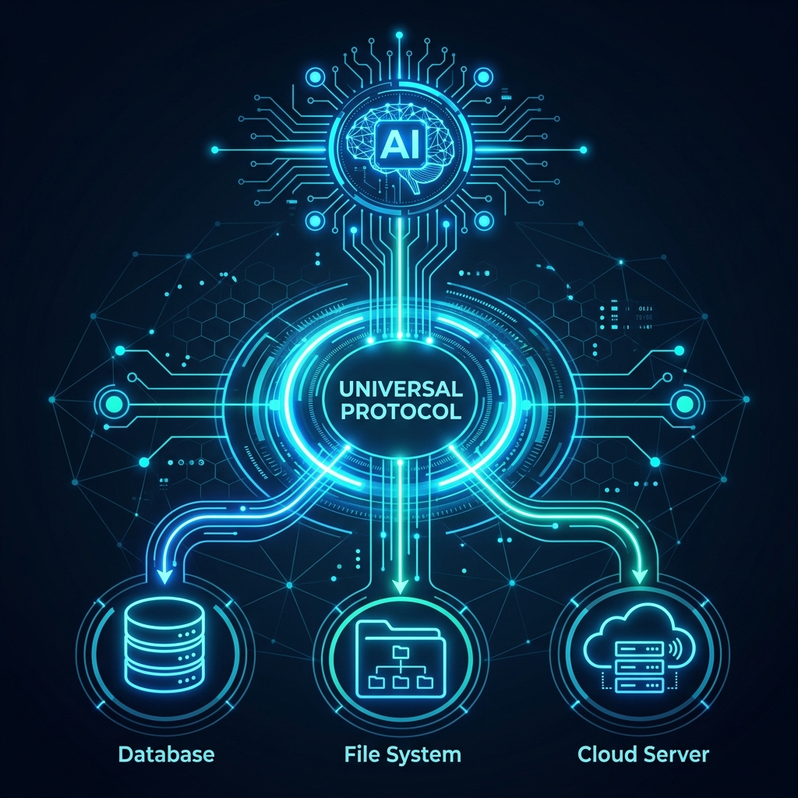

Si has intentado construir un sistema de agentes de IA en producción, conoces el dolor. Durante la construcción del [radar agéntico para Obsolescencia](/es/posts/obs_parte5_radar/), me enfrenté al problema de conectar a Gemini 2.5 con mi base de datos en Supabase y una API externa. Tuve que escribir código específico para adaptar el esquema de herramientas (*Tool Calling*) al formato exacto que exige Google. 

Si mañana decidiera migrar ese mismo sistema a Claude de Anthropic o a GPT-4o de OpenAI, tendría que reescribir toda la capa de integración de herramientas porque cada proveedor usa su propio dialecto de JSON y su propia lógica de validación de argumentos (*Function Calling*).

Es el mismo caos que vivíamos a finales de los 90 con los cargadores de móviles: cada marca tenía su conector propietario. Luego llegó el USB y lo unificó todo. Esa es exactamente la ambición detrás de **MCP (Model Context Protocol)**: convertirse en el USB de la Inteligencia Artificial.



### ¿Qué es exactamente el Model Context Protocol?

Propuesto inicialmente por Anthropic y rápidamente adoptado por una coalición de empresas de código abierto, MCP es un estándar abierto para conectar modelos de IA con fuentes de datos y herramientas. 

La premisa de diseño es elegantemente simple, separando la arquitectura en dos piezas independientes:
1. **MCP Hosts**: Aplicaciones o frameworks donde reside el LLM (por ejemplo, la app de escritorio de Claude, un script de LangChain, o tu propia aplicación en Python).
2. **MCP Servers**: Pequeños programas ligeros que exponen datos o herramientas al Host siguiendo un contrato estándar estricto (por ejemplo, un servidor MCP que lee tu base de datos PostgreSQL, otro que lee tu repositorio de GitHub).

La magia ocurre en el medio. El Host (el LLM) le dice al Servidor MCP: *"¿Qué herramientas y recursos tienes disponibles?"*. El servidor responde en un formato universal. A partir de ahí, el LLM puede leer, escribir o ejecutar acciones sin que el desarrollador haya tenido que escribir una integración propietaria entre *ese modelo específico* y *esa herramienta específica*.

### Comparativa: MCP vs Tool Calling Nativo

En el blog he defendido vehementemente por qué **[el Tool Calling es infinitamente superior al RAG tradicional](/es/posts/obs_parte5_radar/)** para aplicaciones industriales que requieren precisión. MCP no reemplaza al Tool Calling; lo estandariza.

Veamos la diferencia arquitectónica:

| Característica | Tool Calling Clásico | MCP (Model Context Protocol) |
| :--- | :--- | :--- |
| **Integración** | 1 a 1 (Modelo específico ↔ Herramienta específica) | N a M (Cualquier Modelo ↔ Cualquier Servidor MCP) |
| **Formato** | Dictado por el proveedor del LLM (Google, OpenAI) | Estándar JSON-RPC 2.0 agnóstico |
| **Descubrimiento** | El desarrollador inyecta las herramientas en el prompt | El Host descubre herramientas dinámicamente |
| **Portabilidad** | Nula. Migrar de LLM requiere refactorización. | Total. Escribes el servidor MCP una vez. |

### Construyendo un Servidor MCP: Un Ejemplo Real

Para ilustrar por qué esto cambia las reglas del juego para ingenieros de operaciones y backend, imaginemos que queremos exponer una tabla de Supabase (por ejemplo, el inventario de componentes críticos) a nuestro LLM.

Con un enfoque tradicional de CrewAI o Langchain, escribiríamos una herramienta personalizada atada a ese framework. Con MCP, escribimos un servidor universal en Python utilizando el SDK oficial:

```python
from mcp.server.fastmcp import FastMCP
import supabase

# Inicializamos el servidor MCP
mcp = FastMCP("Supabase_Inventory_Server")
db = supabase.create_client(URL, KEY)

@mcp.tool()
def get_critical_stock(part_number: str) -> str:
    """Busca el nivel de stock de un componente específico."""
    response = db.table("inventory").select("stock").eq("pn", part_number).execute()
    
    if not response.data:
        return "Componente no encontrado."
    
    stock = response.data[0]['stock']
    return f"El stock actual para {part_number} es de {stock} unidades."

if __name__ == "__main__":
    # El servidor arranca y escucha peticiones sobre stdio (JSON-RPC)
    mcp.run()
```

Ese bloque de código es todo lo que necesitas. Una vez en ejecución, *cualquier* aplicación compatible con MCP (incluyendo la interfaz oficial de Claude) puede conectarse a este servidor, leer la descripción (docstring) de la función, y decidir cuándo llamar a `get_critical_stock` con los argumentos correctos.

### Opinión: ¿Será MCP el Estándar Definitivo?

La historia del software está llena de "estándares universales" que solo lograron añadir un estándar adicional a la lista de estándares competidores. ¿Sobrevivirá MCP?

Tiene dos ventajas enormes a su favor. La primera es que **resuelve un dolor real y agudo** para los desarrolladores corporativos, que están hartos de reescribir integraciones cada vez que sale un nuevo modelo. La segunda es el **enfoque local-first**. La comunicación estándar de MCP utiliza `stdio` (entrada y salida estándar), lo que significa que el servidor MCP se ejecuta localmente en tu máquina o tu red privada. Esto es un sueño húmedo para la ciberseguridad industrial, porque los datos nunca abandonan tu infraestructura hasta que el LLM los solicita explícitamente y con autorización.

Sin embargo, el éxito de MCP dependerá de la adopción por parte del duopolio dominante: Google y OpenAI. Si Anthropic logra crear un ecosistema open-source lo suficientemente grande (como Kubernetes hizo en su día contra las nubes propietarias), los demás gigantes se verán obligados a soportarlo de forma nativa. 

Si estás diseñando la [arquitectura de un Project Management Office Agéntico](/es/posts/proj_ops_parte2_agentic_pmo/) o cualquier sistema donde necesites conectar agentes de IA con ERPs heredados, PLMs o repositorios documentales, mi recomendación es apostar por aislar tus conectores. Hoy puede ser mediante funciones de Python independientes, y mañana, probablemente, envolviendo esas mismas funciones en un Servidor MCP.

Al igual que el USB mató a cientos de conectores propietarios, MCP tiene el potencial de democratizar finalmente el acceso de los LLMs a la "musculatura" de los datos empresariales.

---

#### Fuentes de Interés:
* [**Model Context Protocol**: Sitio Oficial y Documentación](https://modelcontextprotocol.io/)
* [**Anthropic**: Introducing the Model Context Protocol](https://www.anthropic.com/news/model-context-protocol)
* [**GitHub**: Directorio de Servidores MCP Open Source](https://github.com/modelcontextprotocol/servers)
* [**Datalaria**: El Radar Agéntico: Por qué los LLMs no salvarán tu cadena de suministro (y el Tool Calling sí)](/es/posts/obs_parte5_radar/)
* [**Datalaria**: Project Operations Engineering Parte 2: La Agentic PMO](/es/posts/proj_ops_parte2_agentic_pmo/)
