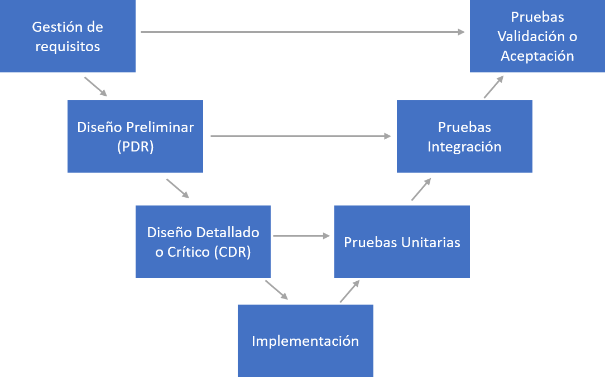
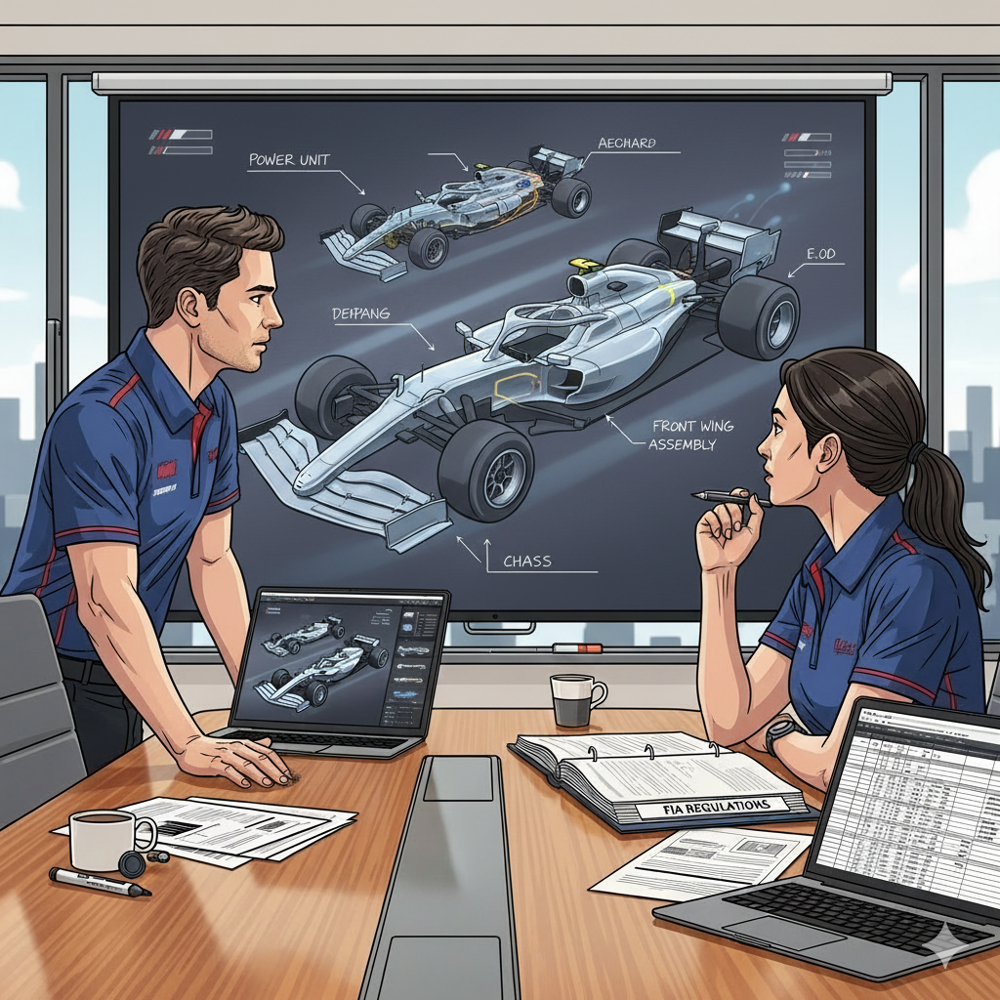
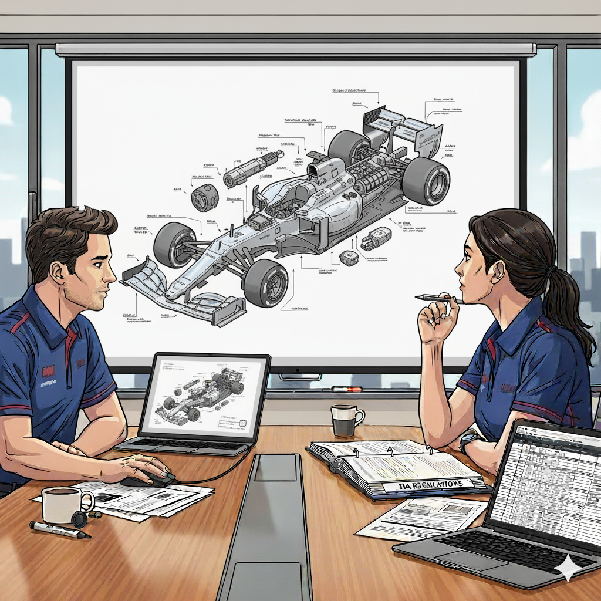
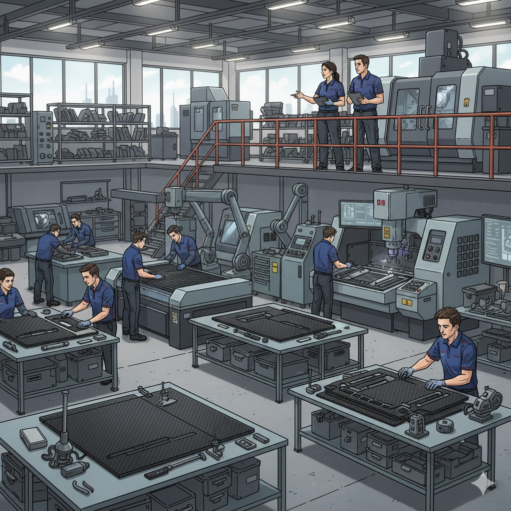
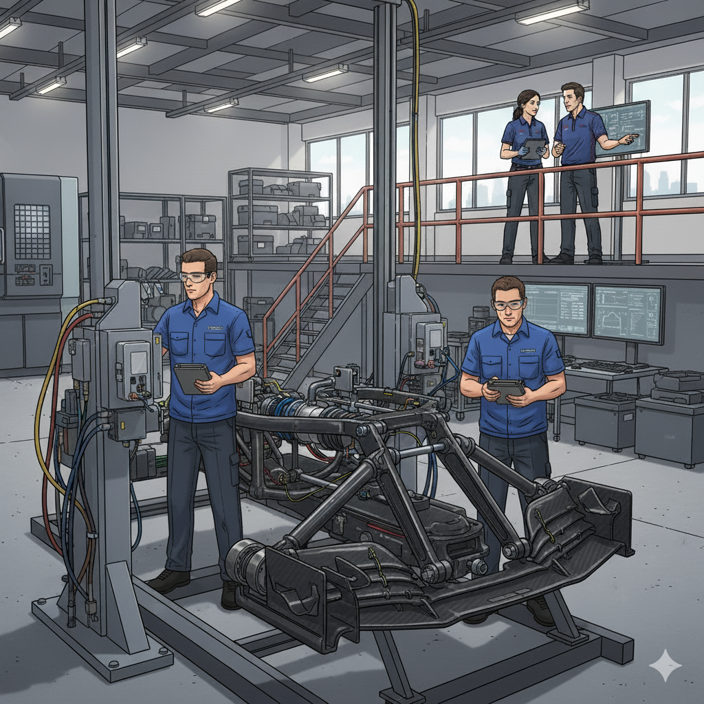
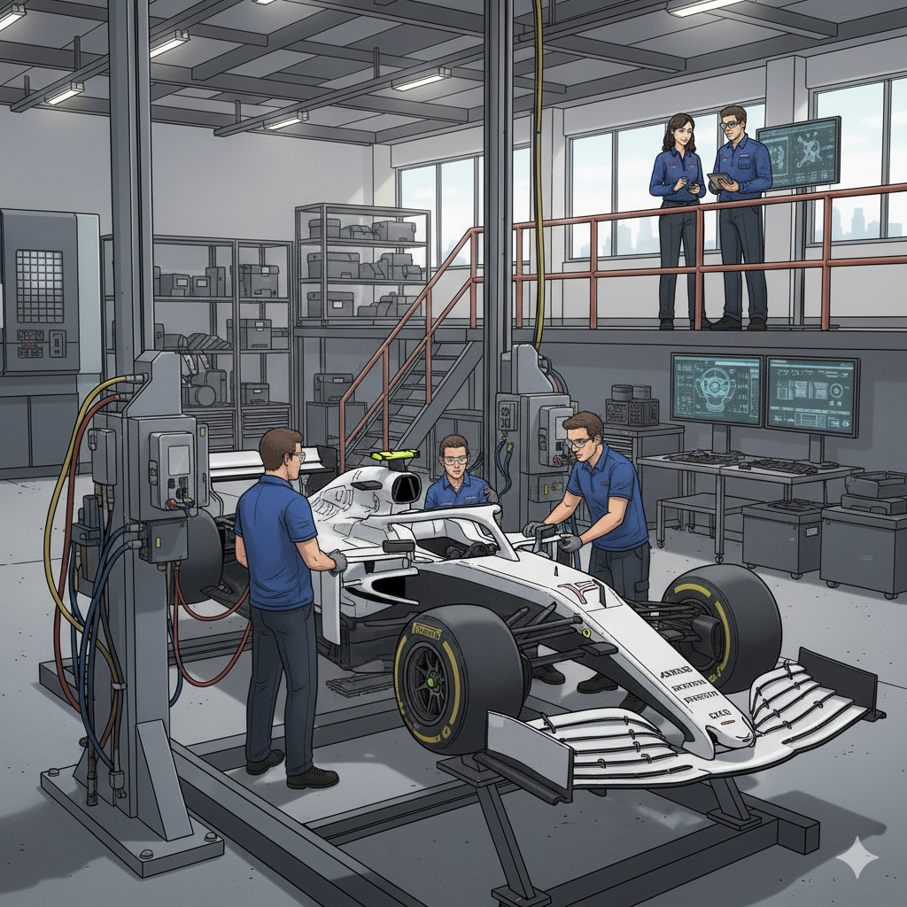
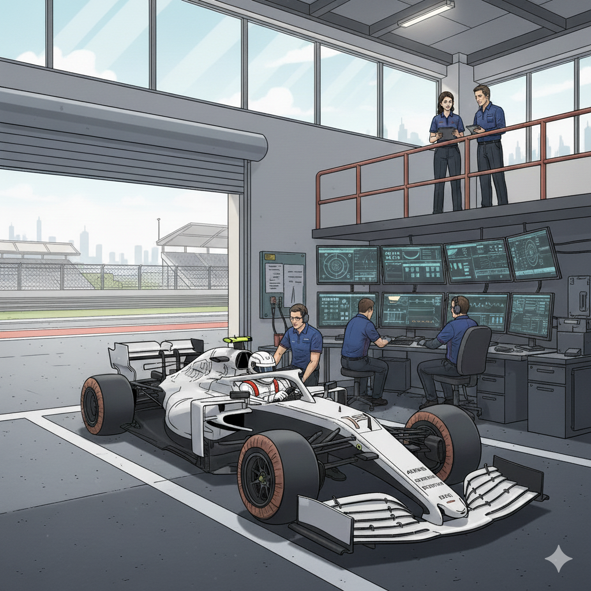
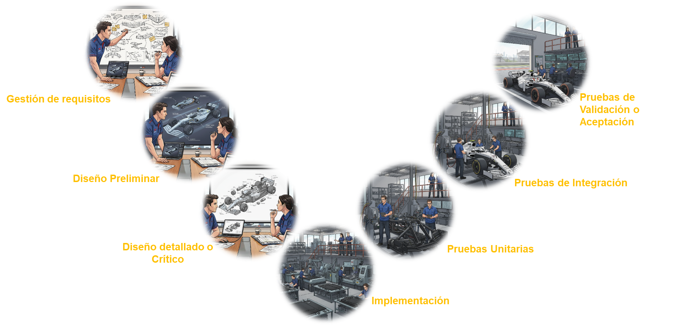

En el mundo de la ingeniería, uno de nuestros mayores desafíos no es resolver el problema técnico, sino **comunicar la solución**. A menudo, nos encontramos frente a directivos, clientes u otros departamentos intentando explicar procesos complejos con diagramas áridos o documentos de cientos de páginas y poco digeribles. El resultado suele ser miradas perdidas y una desconexión entre el equipo técnico y los stakeholders que conduce a una gran confusión entre todas las partes.

Recientemente, me enfrenté a este mismo reto: necesitaba presentar un estado de situación y progreso para la implantación de un proceso complejo de ingeniería cuyo roadmap se asimilaba en gran medida al tradicional **Ciclo en V de la ingeniería de sistemas**. En lugar de recurrir al diagrama de siempre, decidí experimentar y buscar una analogía más atractiva. ¿Y si pudiera usar la IA no solo para analizar datos, sino para contar una historia?

Este post es la crónica y resultado ([Plantilla descargable](Nanobanana_ingenieria.pptx)) de cómo utilicé la herramienta de IA de Google **Nanobanana** para transformar un roadmap de ingeniería en una presentación visual y atractiva, usando una analogía que casi todo el mundo entiende y admira: **el diseño de un monoplaza de Fórmula 1**.

### El Desafío: Hacer Entendible el Ciclo en V

Para quien no lo conozca, el Ciclo en V es un modelo de desarrollo que representa la secuencia de las fases del ciclo de vida de un diseño o desarrollo de un producto. Su gran virtud es que conecta cada fase de diseño y desarrollo con su correspondiente fase de pruebas, asegurando que todo lo que se especifica, se verifica.

Suena lógico, pero su representación gráfica aunque estándar puede ser abstracta y poco inspiradora para aquellos que no están familiarizados con ello. En mi caso, para el simil del proceso a exponer utilicé una variante de diagrama en V básico como el ilustrado a continuación en lugar del diagrama en V tradicional en diseños Hardware o Software con un nivel más de profundidad:

El diagrama en V me facilitaría que el roadmap de la iniciativa a presentar se entendiera mejor, pero para que el concepto calara y quedara una imagen del mismo en la retina de cada stakeholder, necesitaba una metáfora potente. Y pocas cosas combinan diseño, pruebas y un objetivo claro de rendimiento como la creación de un coche de F1.

### La Herramienta: Nanobanana al Rescate

Para materializar esta idea, recurrí a **Nanobanana**, una herramienta de IA especializada en la generación de imágenes y visuales con un estilo limpio y consistente. Su punto fuerte es la capacidad de creación imágenes fieles al contexto solicitado y su capacidad de mantener la coherencia en las diferentes interacciones realizadas, como en mi caso donde buscaba crear el flujo evolutivo de las imágenes en el diseño siguiendo un hilo conductor a la metáfora en vez de ir utilizando imágenes sueltas inconexas.

### El Roadmap Visual: Diseñando un F1 Fase a Fase

El plan era sencillo: para cada fase del Ciclo en V, generaría una imagen que representara la etapa equivalente en el diseño de un monoplaza. A continuación vemos el detalle de cada fase:

#### Fase 1: Gestión de Requisitos

* **En Ingeniería**: Es el punto de partida. Aquí se definen y documentan las necesidades del cliente y las restricciones del sistema. ¿Qué debe hacer el producto?
* **La Analogía F1**: Es la reunión inicial del equipo. Los ingenieros estudian el estricto reglamento de la FIA (las restricciones), analizan los datos de la temporada anterior y escuchan las peticiones del piloto (el cliente). El objetivo es claro: construir un coche ganador.
* **La Petición a Nanobanana**: "Crea una imagen ilustrativa de un par de ingenieros de F1 en una sala de reuniones, analizando un reglamento técnico y dibujando conceptos iniciales en una pizarra."

#### Fase 2: Diseño Preliminar (Arquitectura del Sistema)

* **En Ingeniería**: Se define la arquitectura de alto nivel. ¿Cómo se estructurará el sistema? ¿Cuáles son sus componentes principales y cómo interactúan?
* **La Analogía F1**: Los ingenieros diseñan el concepto general del coche: la distribución de pesos, la filosofía aerodinámica, la integración del motor con el chasis. Es el esqueleto conceptual.
* **La Petición a Nanobanana**: "Mantén una escena similar a la anterior pero cambiando la pizarra del fondo por una pantalla donde se está proyectando un modelo 3D conceptual de un coche de F1, mostrando sus sistemas principales (motor, chasis, aerodinámica) interconectados."

#### Fase 3: Diseño Detallado

* **En Ingeniería**: Se diseñan en detalle los componentes individuales del sistema.
* **La Analogía F1**: El momento de la ultra-especialización. El equipo de aerodinámica diseña cada milímetro del alerón delantero; el de suspensiones, cada pieza de titanio. Son los planos detallados de cada componente.
* **La Petición a Nanobanana**: "Sobre este mismo escenario crea una imagen en la que un ingeniero está trabajando en un diseño CAD o plano detallado del vehículo de F1 visualizándolo en la proyección del fondo."

#### Fase 4: Implementación

* **En Ingeniería**: La fase de "picar código" o construir los componentes físicos.
* **La Analogía F1**: Las máquinas de la fábrica se ponen en marcha. Se mecanizan las piezas, se moldean los monocascos de fibra de carbono. Los planos se convierten en realidad tangible.
* **La Petición a Nanobanana**: "Genera una escena con un estilo de ilustración similar pero que represente en un taller el proceso de fabricación en una fábrica de F1, mostrando a operarios trabajando con piezas de fibra de carbono y maquinaria de precisión, y de fondo al chico y la chica de las imágenes anteriores."

#### Fase 5: Pruebas Unitarias

* **En Ingeniería**: Se verifica que cada componente individual funciona correctamente por separado.
* **La Analogía F1**: Cada pieza fabricada se somete a un control de calidad exhaustivo. El alerón se prueba en el túnel de viento, la suspensión se somete a pruebas de estrés. Se comprueba que cada "unidad" cumple su especificación.
* **La Petición a Nanobanana**: "Genera una imagen de un componente de suspensión de F1 en un banco de pruebas de estrés y manteniendo al fondo al chico y la chica supervisando las pruebas"

#### Fase 6: Pruebas de Integración

* **En Ingeniería**: Se ensamblan los componentes y se prueba que funcionan correctamente juntos.
* **La Analogía F1**: El chasis, el motor, la suspensión y la aerodinámica se unen por primera vez. Se enciende el motor y se comprueba que todos los sistemas se comunican y funcionan en armonía.
* **La Petición a Nanobanana**: "Crea una ilustración de un coche de F1 en el garaje sobre el que unos mecánicos están pasando unas pruebas de integración y el chico y la chica de las imágenes anteriores al fondo supervisándolo."

#### Fase 7: Pruebas de Validación

* **En Ingeniería**: Se valida que el sistema completo cumple con los requisitos originales del cliente.
* **La Analogía F1**: El momento de la verdad. El coche completo sale a la pista por primera vez en los test de pretemporada. ¿Es rápido? ¿Es fiable? ¿Cumple los objetivos marcados en aquella primera reunión?
* **La Petición a Nanobanana**: "Genera una imagen de un coche de F1 saliendo a un circuito de carreras para sus primeras pruebas, con ingenieros monitorizando los datos y el chico y chica del resto de imágenes supervisándolo al fondo de la imagen."

A partir de aquí ya entrará en la fase de mantenimiento de producto y evolutivos.

### Conclusión: La IA como Traductor Universal

En mi caso el resultado fue una presentación con estas 7 etapas como analogías a las fases de implantación de mi iniciativa de proceso y donde este proceso dejó de ser un concepto abstracto para convertirse en pasos "digeribles" e ilustrativos del planteamiento propuesto. La IA, en este caso Nanobanana, no solo generó imágenes; actuó como un **traductor universal**, convirtiendo la jerga técnica de la ingeniería en un lenguaje visual que todo el mundo pudo entender y seguir.

Para aquellos que quieran plantear un Roadmap o historia similar os dejo por aquí la plantilla en ppt con estas imágenes para que la adaptéis a la metáfora o simil que mejor os encaje: [Plantilla en power point de la metáfora del Roadmap](Nanobanana_ingenieria.pptx)

Esta experiencia refuerza mi convicción de que las herramientas de IA no son solo para automatizar tareas, sino también nos facilitan la mejora en otras cualidades blandas (*soft skills*) como para **aumentar nuestras habilidades de comunicación**. En un mundo técnico, saber contar una buena historia es tan importante como tener la solución correcta. Y, a veces, solo necesitas la analogía adecuada y un buen copiloto de IA para llevarla a la vida.

---

#### Fuentes y Recursos:
* **IBM**: [¿Qué es el modelo en V?](https://www.ibm.com/es-es/topics/v-model)
* **Nanobanana**: [Página oficial de la herramienta](https://gemini.google/overview/image-generation/)
* **Gemini**: [Página de Gemini para uso de chatbot con generación de imágenes mediante Nanobanana](https://gemini.google.com/app?hl=es)
