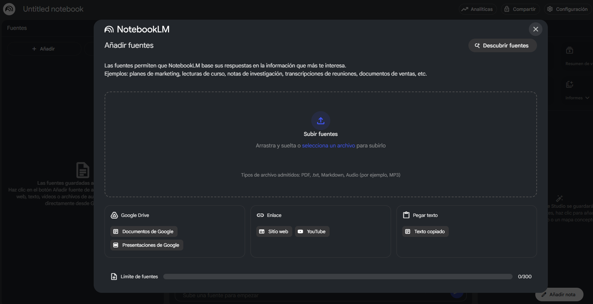
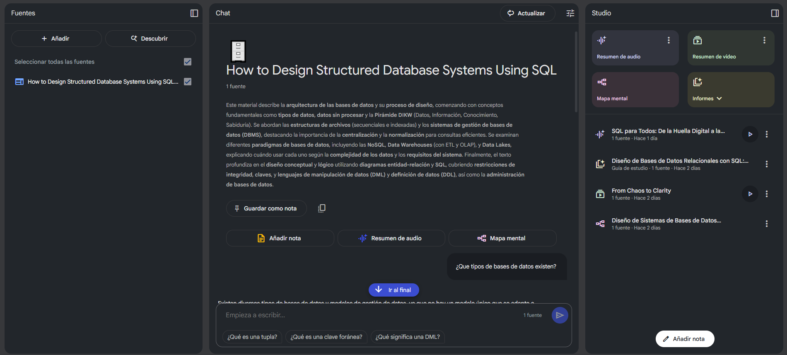
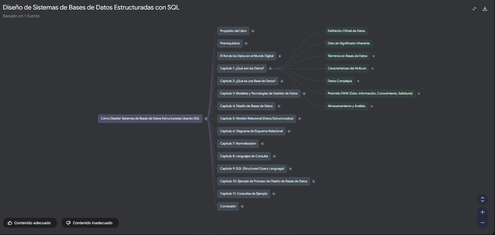

En la actualidad, en la era de la información y el conocimiento, cada vez que queremos aprender algo nuevo, nos enfrentamos a un desafío colosal con montañas de información en bruto. Libros, *papers* académicos, cualquier tipo de documento, páginas webs, videos, podcasts... Extraer el conocimiento que no es realmente útil de todas estas fuentes es un trabajo arduo que consume nuestro recurso más valioso: el tiempo. Sin perder de vista el valor que ofrece la navegación a la deriva entre estos mares de información en sí, formando y consolidando los cimientos de cada temática o conocimiento, siempre he buscado herramientas que optimicen este proceso y me permitan apuntar a los conceptos o directrices clave durante todo esta navegación y proceso. En este artículo, voy a hablar de la herramienta más revolucionaria que he conocido hasta la fecha y que va a cambiar por completo mi flujo de trabajo **NotebookLM de Google**.

Para ilustrar en qué consiste y entender su potenciar, me he basado en un ejemplo práctico a partir del interesantísmo libro compartido en [freecodeamp](https://www.freecodecamp.org/) por **Daniel García Solla** [**How to Design Structured Database Systems Using SQL**](https://www.freecodecamp.org/news/how-to-design-structured-database-systems-using-sql-full-book/) sobre el diseño de bases dede datos SQL el cual, con la ayuda de NotebookLM, lo transformé en un completo arsenal de aprendizaje multimedia.

## ¿Qué es NotebookLM y por qué es una revolución silenciosa?

Imagina un asistente de investigación personal que ha leído y entendido perfectamente *solo las fuentes (documentos, videos, podcasts...) que tú le proporcionas*. Esa es la esencia de NotebookLM. A diferencia de otras IAs que bucean en todo internet (independientemente de la fiabilidad de las fuentes), NotebookLM se **basa exclusivamente en tus fuentes**.

Esta simple premisa es su superpoder. Al estar "anclado" a tus documentos, **elimina las alucinaciones y las respuestas genéricas**. Su conocimiento es tu conocimiento, lo que lo convierte en un experto a medida sobre cualquier tema que le entregues (PDFs, Google Docs, URLs, etc.).

## Mi Campo de Batalla: Un Libro Técnico sobre SQL

Para ponerlo a prueba, elegí una fuente especializada y detallada: el libro completo [**How to Design Structured Database Systems Using SQL**](https://www.freecodecamp.org/news/how-to-design-structured-database-systems-using-sql-full-book/) compartido por **Daniel García Solla** en [freecodeamp](https://www.freecodecamp.org/). 
Mi objetivo no era solo "resumirlo", sino deconstruirlo y reconstruirlo en formatos que se adaptaran a diferentes formas de aprendizaje que me fueran facilitando el proceso para la asimilación de los diferentes conceptos.

El primer paso fue tan simple como entrar en la herramienta [**NotebookLM**](https://notebooklm.google.com/) y crear un nuevo "cuaderno" enlazando a la URL con el contenido del libro. En segundos, NotebookLM no solo lo había procesado, sino que ya me ofrecía un resumen inicial y preguntas clave. 

Pero esto era solo el comienzo...

## De la Información al Conocimiento: Mis 4 Creaciones

A partir de ahí es donde la magia empieza a ocurrir. Usando una serie de prompts específicos ya predefinidos sobre la propia herramienta, lancé sobre NotebookLM la generación de diferentes recursos de aprendizaje de alto valor:

### 1. El Mapa Mental: La Estructura en un Vistazo 🗺️

Para entender la arquitectura del libro, necesitaba una vista de pájaro. Y, para ello NotebookLM me presenta un botón muy aparente llamado **Mapa Mental**. Presionándolo, y como por arte de magia...

Una estructura perfectamente organizada que me permitió navegar por los conceptos del libro, desde el modelo relacional hasta las consultas complejas, entendiendo cómo cada pieza encajaba en el todo. Ideal para estructurar el estudio.

### 2. El Resumen para Vídeo: El Guion Didáctico 🎬

Siguiente truco, ¿sería capaz de generar un recurso visual como un video explicativo de todo este contenido? La idea sería generar un video breve introductorio a los principales conceptos recogidos en el libro que me permitiera ver el bosque antes de adentrarme árbol a árbol. Y, con este fin, NotebookLM nos ofrece un botón con la funcionalidad de **Resumen Video** a partir de la cual se pone la gorra de editor de video y en unos minutos nos genera un impresionante video resumen con parte de los aspectos clave tratados en el libro y expuestos de manera clara y didáctica en un formato narrativo que mantiene la atención del espectador.

**Resumen de video libro "How to Design Structured Database Systems Using SQL"**: [Resumen de video generado por NotebookLM](https://notebooklm.google.com/notebook/b84af865-6950-4686-bb15-0b27e8cc6871?artifactId=14280bf8-acba-427e-9e27-7925623dd45e) 

### 3. El Resumen de Audio: El Podcast para Aprender en Movimiento 🎧

Asombrado todavía por estas capacidades de NotebookLM y queriendo poder compaginar los conceptos del libro mientras viajo o hago deporte, lancé la funcionalidad de **Resumen de audio** a partir de la cual, y como por arte de magia nuevamente, se genera un podcast de audio natural entre 2 personas fácil de seguir y donde lo más sorprendente es como la IA de la herramienta es capaz de adaptar el tono, el formato o los contenidos de una manera muy natural y amena para enganchar al espectador.

**Resumen de audio libro "How to Design Structured Database Systems Using SQL"**: [Resumen de audio generado por NotebookLM](https://notebooklm.google.com/notebook/b84af865-6950-4686-bb15-0b27e8cc6871?artifactId=2527a2fc-e866-4544-a030-4bddaa1ee2f1) 

### 4. El Informe de Guía de Estudio: Mi Compañero de Repaso Definitivo 📝

Y, finalmente, y una vez consumidos el resto de recursos y tras haberme contenido y profundizado en las partes del libro que más me interesaban, probé la funcionalidad de **Informes** que nos ofrece NotebookLM para consolidar y autoevaluar mi conocimiento. En concreto, lancé la **guía de estudio** dentro de los informes y el resultado fue la creación de una serie de preguntas, ejercicios y un glosario perfectamente extraídos y formulados, creando una herramienta de repaso de muy alto valor.

## Veredicto final: ¿Para Quién es NotebookLM?

Tras haberlo probado en detalle creo que **NotebookLM es la herramienta definitiva para el trabajo profundo y enfocado a un tema o conocimiento concreto**, frente al uso del resto de IAs generalistas existentes actualmente que son excelentes para fomentar la creatividad y la exploración abierta, pero sin el enfoque o practicidad que te ofrece esta herramienta.

En resumen, NotebookLM es ideal para:
* **Estudiantes y Académicos**: Para desglosar *papers*, libros de texto o apuntes.
* **Profesionales**: Para analizar informes de mercado, documentación técnica o contratos legales.
* **Creadores de Contenido**: Para transformar una fuente de conocimiento en múltiples formatos de contenido.

## Conclusión

NotebookLM no es solo una herramienta para encontrar respuestas más rápido a partir de fuentes fiables concretas. Es un catalizador para pensar mejor y/o aprender más rápido y de manera más consciente. NotebookLM te permite dialogar con las fuentes, desafiarlas y, lo más importante, transformarlas en conocimiento activo y útil personalizado a cada necesidad. Sin duda esta herramienta va a cambiar radicalmente el proceso de aprendizaje y creación, convirtiendo la abrumadora tarea de "leer y leer" durante las fases de investigación y aprendizaje en un emocionante proceso de "construir".

Te invito a que lo pruebes con tus propios documentos, podcasts, videos... La experiencia, te lo aseguro, es reveladora.

P.D: Ah, y por si todo esto fuera poco, puedes probar a introducirle fuentes en otros idiomas y generar los resultados de aprendizaje en otro idioma diferente. ¿Qué te parece?

---

#### Fuentes y Referencias:

* **NotebookLM**: [Página oficial de NotebookLM](https://notebooklm.google.com/)
* **How to Design Structured Database Systems Using SQL (Post de Daniel García Solla en freecodecamp)** [Post de freecodecamp que recoge el contenido del libro](https://www.freecodecamp.org/news/how-to-design-structured-database-systems-using-sql-full-book/)
* **Cuaderno de ejemplo para el post: How to Design Structured Database Systems Using SQL**: [Puedes explorar el cuaderno que creé para este post aquí](https://notebooklm.google.com/notebook/b84af865-6950-4686-bb15-0b27e8cc6871)