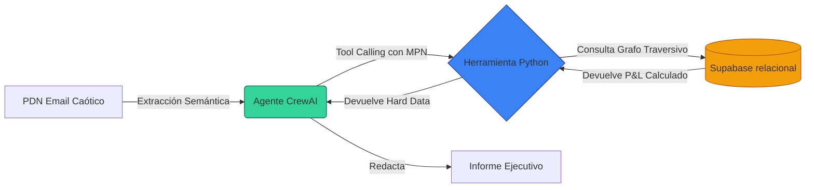

En el último año, la obsesión generalizada por las arquitecturas RAG (*Retrieval-Augmented Generation*) ha empujado a cientos de empresas a un cuello de botella sistémico. La promesa era seductora: "sube tus documentos y chatea con tus datos". Pero en la trinchera industrial, donde los márgenes de error operan en milisegundos y micras, preguntar a un modelo lingüístico por el impacto financiero de una rotura de stock es una negligencia auditable.

Los LLMs (Large Language Models) son motores de abstracción semántica brillantes, pero calculadoras mediocres. Si le entregas a un LLM un Aviso de Discontinuación de Producto (PDN) y le pides calcular el riesgo para la **Cuenta de Resultados (P&L)** sobre un árbol de materiales (BOM) con 40.000 dependencias, alucinará el resultado. En la industria pesada, un error de 100.000€ derivado de una probabilidad estocástica es inaceptable.

Para que la Inteligencia Artificial resuelva el problema de la **Gestión de Obsolescencia**, debemos aplicar el *First Principles Thinking*: quitarle las matemáticas analíticas al modelo, y proveerle de herramientas deterministas. 

### La Arquitectura: Separar el Cerebro del Músculo

La evolución obvia de la IA generativa es el **Tool Calling** (Llamada a Herramientas). El concepto arquitectónico es rotundo: orquestamos un clúster de agentes cuya única misión es extraer hiper-contexto (el cerebro) y ejecutar *scripts* blindados para las operaciones en la base de datos (el músculo).

1. **El Cerebro (Gemini 2.5 + CrewAI):** Se expone al caos del formato libre. Ingiere el correo raw del fabricante (por ejemplo, Texas Instruments), sortea las ambigüedades idiomáticas, detona la jerga y aísla limpia y unívocamente el *Manufacturer Part Number (MPN)*.
2. **El Músculo (Python + Supabase SQL):** Recibe el parámetro MPN validado por el cerebro. Baja a trinchera, realiza el cruce contra nuestra tabla *AML* (Approved Manufacturer List), escanea el grafo bidireccional de la lista de materiales (`bom_lines`) con latencia sub-milisegundo, y suma exactamante el `gross_margin` de cada código padre impactado. 

El siguiente diagrama modela el flujo de este **Radar Agéntico**:



### Programando al Analista (Orquestación con CrewAI)

Para materializar esto, instanciamos un clúster utilizando el *framework* **CrewAI**. El objetivo es imponer restricciones de hierro al modelo subyacente (en nuestro caso, un `gemini-2.5-flash`): se le prohíbe explícitamente deducir el impacto financiero por sí mismo. *Debe* ejecutar la herramienta de base de datos.

```python
from crewai import Agent, Task, Crew, Process

analyst_agent = Agent(
    role="Senior Supply Chain Risk Analyst",
    goal="Identificar componentes obsoletos y cruzar datos del mercado con el P&L interno de la empresa.",
    backstory="Eres un ingeniero de operaciones implacable y matemático. No asumes absolutamente nada ni alucinas información. Siempre utilizas tus herramientas conectadas a las bases de datos relacionales. Tu dialéctica es puramente técnica.",
    verbose=True,
    allow_delegation=False,
    llm="gemini/gemini-2.5-flash",
    tools=[calculate_financial_impact]
)
```

### Definiendo la Herramienta en Bare Metal

El bloque `calculate_financial_impact` no es una capa prompt adicional, es un script recursivo duro en entorno Python inyectado al LLM con el decorador `@tool`. Este script consulta la API REST de nuestro ecosistema Supabase cruzando el vector de vulnerabilidades en tres saltos relacionales:

1. **Gatekeeping:** Valida la existencia del `MPN` en el radar global (`manufacturer_parts`).
2. **Traspaso de Firewall Interno:** Asocia el código del proveedor con nuestra UUID interna a través de la matriz de aprobación (`aml`).
3. **Ascensión por el Grafo:** Recorre iterativamente la jerarquía (desde un componente resistivo al ensamblaje PCB, y desde el PCB hasta el servidor final) en la tabla `bom_lines`, agregando en memoria los euros expuestos del producto final.

Toda la computación y la integridad referencial ocurren donde fueron diseñadas para operar: en las entrañas del clúster PostgreSQL. 

### El Output Ejecutivo: Matemáticas Libres de Humo

Una vez que el modelo recupera el string determinista retornado por la base de datos, procede a cumplir la última directiva logística: formatear la salida en un manifiesto corporativo para la cúpula directiva (C-Level). 

Ante un correo *mock* informando del cierre de unas instalaciones de fabricación obsoletas (EOL - End of Life) de la pieza `TI-CAP-10U-50`, el sistema autónomo genera esta evaluación en menos de 4 segundos:

> **REPORTE EJECUTIVO FINAL (AUTORÍA: IA AGENT)**
> 
> **Número de Pieza Afectado:** TI-CAP-10U-50
> 
> **Análisis de Impacto P&L:** La consulta a la infraestructura relacional confirma que la discontinuidad de este componente bloquerará la matriz de producción del ensamblaje vinculado al producto final **DRONE-X1**.
> 
> **Cuantificación del Riesgo:** La paralización de la línea DRONE-X1 expone un margen de beneficio retenido de **450.50€** por unidad base desplegada. Es imperativo emitir órdenes de "Last Time Buy" antes de agotar los *buffers* de fabricación en la ventana temporal designada (Octubre 2026).

Silencio operativo. Cero divagaciones sobre el clima, ni explicaciones redundantes sobre qué es un condensador. Diagnóstico instantáneo para desatar órdenes de compra ágiles e inmediatas.

---

### Próximos Pasos en la Escalabilidad

El Radar Agéntico demuestra una asombrosa resiliencia táctica analizando un documento de forma aislada. No obstante, las fábricas globales no duermen, y el caos externo es constante. 

En la próxima entrega, escalaremos la arquitectura llevando este agente desde el modo intermitente hasta un motor continuo (24/7). Conectaremos a nuestro analista silencioso directamente contra un servidor de correos crudo y herramientas de *webhooks*, procesando cientos de boletines diarios y automatizando el flujo de contingencia antes de que la planta logística ni siquiera sea consciente de la amenaza. 
