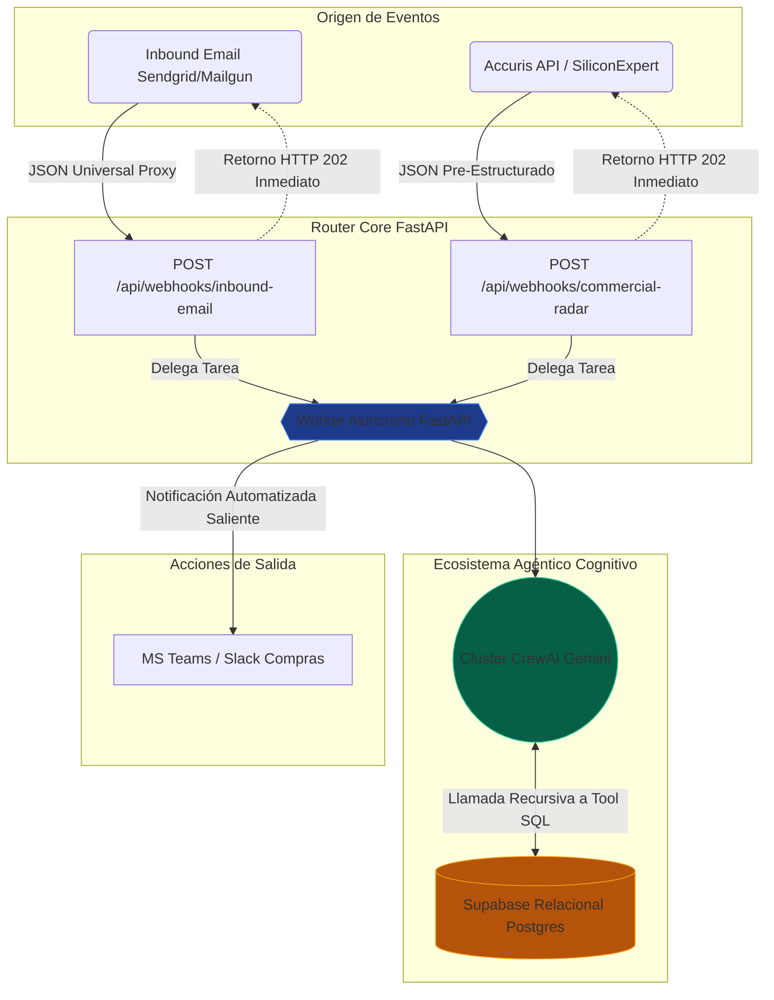

En el bloque anterior de nuestra serie, demostramos que la Inteligencia Artificial puede calcular el impacto financiero (P&L) de la obsolescencia de componentes. Esto se logró aislando el módulo de inferencia semántica de la ejecución, utilizando herramientas SQL deterministas. 

Sin embargo, ejecutar un script de Python localmente en una terminal no es apto para producción. Los avisos de discontinuidad (PDN) llegan de manera continua desde distintas zonas horarias. Las operaciones de la cadena de suministro requieren un sistema centralizado, continuo y escalable.

Para alcanzar el grado de producción, la arquitectura debe transicionar hacia una **Arquitectura Orientada a Eventos (EDA)**.

### Topología Base: Vectores Legacy vs. Marcos API

A nivel arquitectónico, los sistemas logísticos deben soportar dos métodos distintos de ingesta de alertas:

1. **El Vector Moderno (APIs B2B SaaS):** Las herramientas comerciales de gestión del ciclo de vida de componentes, como SiliconExpert o Accuris, proveen datos estructurados. Estas plataformas envían cargas JSON estandarizadas detallando las transiciones de mercado. 
2. **El Vector Legacy (Email):** Muchos fabricantes y proveedores Tier 2 continúan utilizando correos electrónicos en texto plano o archivos PDF adjuntos para anunciar los cierres de fábricas o estados EOL. 

**La decisión de Ingeniería de Software:** Hacer *polling* continuo a bandejas IMAP mediante procesos de Python consume recursos y añade latencia. En su lugar, utilizamos pasarelas de *Inbound Parse* (como SendGrid o Mailgun). Estos servicios interceptan los correos, extraen las propiedades relevantes (Asunto, Cuerpo), las empaquetan en un JSON estandarizado y las reenvían a un endpoint de integración. Mediante este enfoque, ambos canales de comunicación se normalizan en peticiones HTTPS POST estándar.

### Enrutamiento: Estructurando el Backend con FastAPI

Utilizamos **FastAPI** para construir el microservicio asíncrono en Python. El objetivo es desplegar una capa de enrutamiento que dirija las alertas entrantes hacia el framework de CrewAI.

El siguiente código simplificado demuestra la implementación dual de webhooks:

```python
@app.post("/api/v1/webhooks/commercial-radar")
async def commercial_radar_webhook(alert: CommercialAlert, background_tasks: BackgroundTasks):
    # Protocolo Vector 1: Consumo de APIs Comerciales
    synthetic_pdn = f"Manufacturer: {alert.manufacturer}. MPN: {alert.mpn}. Status: EOL."
    
    background_tasks.add_task(process_obsolescence_background, synthetic_pdn)
    return {"status": "accepted"}

@app.post("/api/v1/webhooks/inbound-email")
async def inbound_email_webhook(email: InboundEmail, background_tasks: BackgroundTasks):
    # Protocolo Vector 2: Carga de Email Parseado
    pdn_text = f"Subject: {email.subject}\nBody: {email.text}"
    
    background_tasks.add_task(process_obsolescence_background, pdn_text)
    return {"status": "accepted"}
```

### Ejecución Asíncrona: Manejo de la Latencia del LLM

El fragmento anterior resalta un patrón obligatorio para la resiliencia web al integrar LLMs. Un ciclo de inferencia orquestado por CrewAI habitualmente requiere de 5 a 15 segundos para completarse. Este proceso implica parsear la entrada, extraer el número de pieza, consultar el grafo relacional en Supabase, calcular el impacto financiero y dar formato a la respuesta.

Mantener el *socket* HTTP abierto mientras se espera esta ejecución provocará que la API emisora (e.g., SendGrid) registre un error de *Timeout* (generalmente limitado a 10 segundos), derivando en reintentos internos redundantes. La solución estándar es desacoplar la ejecución utilizando **Background Tasks (Tareas en Segundo Plano)**. 

El servidor devuelve inmediatamente un código de estado "HTTP 202 Accepted", cerrando la conexión con el cliente. Simultáneamente, el *worker* interno instancia las operaciones del LLM en segundo plano sin bloquear los recursos de red.

### El Bucle de Control: Notificaciones del Sistema

Si el agente autónomo evalúa con éxito el riesgo temporal pero solo registra el output localmente, el sistema no cumple su propósito operativo. Los datos de salida deben ser enviados a los responsables correspondientes.

La etapa final de la arquitectura consiste en mandar el informe de mitigación generado a los canales de comunicación del equipo de compras (como Microsoft Teams o Slack) a través de un webhook de salida.

```python
def process_obsolescence_background(pdn_text: str):
    # ... Iteración de Inferencia Multi-Agente ...
    assessment = execute_obsolescence_analysis(pdn_text)
    
    # Alerta a Compras vía MS Teams/Slack
    header = f"🚀 Alerta de P&L Agéntica Procesada\n"
    notify_teams(header + str(assessment))
```

### Arquitectura Completa del Sistema

La integración de estos módulos forma una *pipeline* orientada a eventos donde las consultas a tablas SQL y el procesamiento de texto de LLMs operan en conjunto de forma asíncrona.



### Próximos Pasos 

Hemos configurado el motor de ingesta de datos (Bloque 2), establecido el framework de inferencia semántica (Bloque 3) y desplegado un servicio centrado en API para procesar anomalías globales de componentes 24/7 (Bloque 4). 

En el segmento final de esta serie de ingeniería, nos enfocaremos en la visualización de datos. Documentaremos cómo exponer estas alertas asíncronas mediante la construcción de un **Dashboard Ejecutivo**, haciendo que las operaciones del agente sean accesibles para la revisión gerencial.
