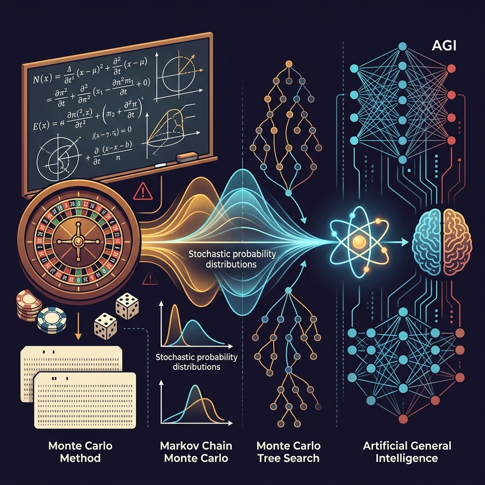

A las 5:29 de la madrugada del 16 de julio de 1945, sobre las arenas blanquecinas de la llanura de *Jornada del Muerto*, en el desierto de Nuevo México, una detonación sin precedentes rasgó la noche con el brillo de mil soles. La onda de choque térmica pulverizó la torre de acero de pruebas, vitrificó la arena en una costra verde radiactiva bautizada como *trinitita* y elevó un hongo atómico de doce kilómetros hacia la estratosfera.

A varios kilómetros de distancia, resguardado tras un búnker de hormigón, un hombre esquelético de ojos intensamente azules, consumido por el insomnio crónico, el humo incesante de los cigarrillos Chesterfield y con un peso de apenas cincuenta kilos bajo su traje de chaqueta arrugado, contempló la bola de fuego en silencio.

En ese instante fugaz, acudieron a su memoria los versos sagrados del *Bhagavad Gita* que había aprendido a leer directamente en sánscrito:

> *«Si el resplandor de mil soles estallara a la vez en el cielo, sería como el esplendor del Ser Supremo... Ahora me he convertido en la Muerte, el destructor de mundos».*

Aquel hombre era **Julius Robert Oppenheimer**.

Ampliamente recordado como el director científico del Proyecto Manhattan y «padre de la bomba atómica», la figura de Oppenheimer suele confinarse al ámbito militar y político. Sin embargo, para la comunidad de datos e ingeniería de software, Los Álamos fue el crisol donde nació una revolución silenciosa que sostiene toda la computación moderna: **el nacimiento del Método de Monte Carlo y la simulación algorítmica**.

Continuando la estela de nuestros perfiles históricos dedicados a [Ada Lovelace](/es/posts/ada_lovelace/), [Alan Turing](/es/posts/alan_turing/), [Claude Shannon](/es/posts/claude_shannon/) y [Thomas Bayes](/es/posts/thomas_bayes/), este artículo recorre las luces y sombras de Oppenheimer, el alumbramiento del cálculo probabilístico por ordenador y el inquietante paralelismo entre la carrera nuclear de 1945 y la carrera por la **Inteligencia Artificial General (AGI)** en 2026.



### El Polímata Improbable: Poesía, Sánscrito y Manzanas Envenenadas

Nacido en Nueva York en 1904 en el seno de una adinerada familia de origen judío-alemán, Oppenheimer fue desde su infancia un prodigio intelectual de una intensidad abrumadora y una fragilidad emocional extrema. A los doce años ya impartía conferencias sobre mineralogía en el Club Mineralógico de Nueva York.

Capaz de dominar ocho idiomas (incluyendo griego, latín, francés, alemán, holandés y sánscrito), su apetito intelectual desafiaba cualquier categorización académica:
* **El sánscrito como refugio filosófico**: En la Universidad de Berkeley, en la década de 1930, Oppenheimer estudió sánscrito clásico bajo la tutela del profesor Arthur W. Ryder para poder leer los textos filosóficos hindúes en su métrica poética original, buscando en ellos respuestas a la angustia existencial que la física cuántica no alcanzaba a calmar.
* **El infame incidente de la manzana en Cambridge**: Durante su estancia doctoral en el laboratorio Cavendish en 1925, sumido en una profunda depresión y frustrado por su torpeza experimental frente a la brillantez teórica, dejó sobre el escritorio de su tutor, el futuro premio Nobel Patrick Blackett, una manzana impregnada con sustancias químicas tóxicas de laboratorio. El incidente estuvo a punto de costarle la expulsión de Cambridge y la cárcel, salvándose únicamente por la influencia y la fortuna de su padre.
* **El místico del desierto**: Enfermo de tuberculosis en su juventud, Oppenheimer descubrió su pasión por la meseta desértica de Nuevo México. Alquiló una cabaña rústica bautizada como *Perro Caliente* y pasaba semanas cabalgando solo a caballo entre pinos y cañones, vistiendo su icónico sombrero *pork pie*, forjando la íntima conexión con el paisaje árido que años más tarde le llevaría a elegir Los Álamos como sede del laboratorio ultrasecreto.

Científicamente, su mente era de una rapidez deslumbrante. En 1939, junto a su alumno Hartland Snyder, publicó el artículo seminal *"On Continued Gravitational Contraction"*, donde aplicó la teoría de la relatividad general de Einstein para predecir por primera vez en la historia la existencia física de lo que hoy conocemos como **agujeros negros** (el límite de Tolman-Oppenheimer-Volkoff).

### La Forja de Los Álamos: La Ingeniería del Caos Humano

Cuando el general Leslie Groves reclutó a Oppenheimer en 1942 para liderar el Laboratorio Científico de Los Álamos (Project Y), la decisión causó estupefacción en el estamento militar: Oppenheimer no tenía el Premio Nobel, carecía por completo de experiencia administrativa y acarreaba simpatías comunistas en su círculo familiar cercano.

Sin embargo, Groves vio en él lo que nadie más supo apreciar: **una capacidad sobrehumana para comprender todas las disciplinas técnicas simultáneamente y un magnetismo intelectual irresistible**.

En menos de tres años, Oppenheimer transformó un internado aislado de montaña en una ciudad secreta de más de seis mil personas, coordinando a la mayor constelación de genios científicos jamás reunida: **Enrico Fermi, Hans Bethe, Richard Feynman, Edward Teller, Stanisław Ulam y John von Neumann**.

Su liderazgo no fue burocrático; fue de integración de sistemas (*Systems Engineering*):
1. **Derribar el secretismo interno**: Pese a la obsesión militar por la compartimentación, Oppenheimer impuso coloquios semanales abiertos donde físicos teóricos, químicos de explosivos, metalúrgicos y militares debatían libremente los cuellos de botella del proyecto.
2. **Modularidad y orquestación extrema**: Al igual que analizamos en la gestión de operaciones críticas en [Project Operations Engineering](/es/posts/proj_ops_parte1_intro/) y en las restricciones de planta de [The Goal](/es/posts/the-goal/), Oppenheimer sincronizó dos vías de enriquecimiento de material fisible completamente dispares (el uranio-235 en Oak Ridge y el plutonio-239 en Hanford) con el diseño mecánico de la bomba de implosión.

### El Nacimiento de la Simulación: El Método de Monte Carlo

En la primavera de 1946, concluida la guerra pero inmersos en los cálculos de la bomba de hidrógeno y la física de reactores, el matemático polaco **Stanisław Ulam** convalecía en su casa de Los Álamos recuperándose de una encefalitis. Para matar el aburrimiento, jugaba interminables partidas de solitario con una baraja de cartas.

Como matemático, Ulam intentó calcular mediante análisis combinatorio puro la probabilidad exacta de que una mano de cartas resultara ganadora. Las ecuaciones eran inmanejables. De pronto, tuvo una epifanía genial: **en lugar de resolver la fórmula matemática exacta, ¿por qué no repartir cien partidas completas, anotar cuántas salían ganadoras y estimar la probabilidad empíricamente?**

Ulam compartió la idea con su gran amigo y colaborador **John von Neumann**, quien comprendió de inmediato la trascendencia del concepto para la física nuclear.

En Los Álamos, los científicos se enfrentaban a un dilema irresoluble: predecir cómo se difunden billones de neutrones a través de una masa esférica de plutonio sometida a una onda de choque explosiva. Las ecuaciones diferenciales parciales de Boltzmann eran analíticamente imposibles de resolver.

Von Neumann y Ulam diseñaron el algoritmo definitivo:
* En lugar de calcular el comportamiento colectivo de todos los neutrones a la vez, el sistema simula el viaje individual de un solo neutrón.
* Cada colisión, absorción o fisión se decide mediante **números pseudoaleatorios** ponderados por las probabilidades físicas reales de la materia.
* Repitiendo la simulación cientos de miles de veces en las primeras calculadoras mecánicas de tarjetas perforadas de IBM (y más tarde en el ordenador ENIAC), la distribución agregada converge con asombrosa precisión hacia la solución física real.

El proyecto era ultrasecreto. El físico Nicholas Metropolis sugirió el nombre en clave: **Método de Monte Carlo**, en homenaje al tío de Ulam, quien pedía dinero prestado a sus familiares para apostar en el legendario casino de Mónaco.

#### De Los Álamos a la Inteligencia Artificial Moderna
Sin el Método de Monte Carlo inventado bajo el liderazgo de Oppenheimer, la Inteligencia Artificial del siglo XXI sencillamente no existiría:
* **Markov Chain Monte Carlo (MCMC)** es el pilar de la inferencia probabilística que exploramos en [Thomas Bayes](/es/posts/thomas_bayes/).
* El muestreo estocástico (*Temperature sampling*) es lo que permite a los LLMs modernos generar respuestas creativas y variadas en lugar de repetir siempre la palabra estadísticamente más obvia.
* Y más determinante aún: el algoritmo **Monte Carlo Tree Search (MCTS)** fue la pieza clave que permitió a Demis Hassabis y al equipo de DeepMind construir AlphaGo y AlphaZero, desentrañando el juego de Go y la estructura tridimensional de las proteínas como documentamos en [The Thinking Game](/es/posts/the_thinking_game/).

### El 'Momento Oppenheimer' de la Inteligencia Artificial

Durante décadas, la advertencia de Oppenheimer tras Trinity fue vista como una metáfora exclusiva del armamento nuclear. Hoy, en 2026, la metáfora ha cambiado de trinchera: **es el espejo exacto en el que se miran los creadores de la Inteligencia Artificial General**.

No es una coincidencia retórica. Las mentes más influyentes de la IA actual han adoptado explícitamente el paralelismo:
* **Geoffrey Hinton**, tras abandonar Google para advertir libremente sobre los riesgos de los sistemas inteligentes, declaró que sentía el mismo remordimiento y desvelo moral que atormentó a Oppenheimer tras Hiroshima.
* **Demis Hassabis** (Google DeepMind), en sus reflexiones sobre el salto hacia la AGI con modelos como **Gemini 3.8 / 4 Pro**, ha comparado repetidamente la concentración masiva de talento, supercómputo y secretismo tecnológico actual con el esfuerzo multidisciplinar de Los Álamos.
* **Dario Amodei** (Anthropic, creadores de **Claude Fable 5.1 / Mythos**) y **Sam Altman** (OpenAI, tras el despliegue de **GPT Sol 5.6 / Astra**) articulan su discurso público en torno a la misma tensión fundamental: la certeza de que están creando una tecnología que superará las capacidades de control de sus propios diseñadores.

#### Las Tres Paradojas Compartidas entre 1945 y 2026

1. **La Carrera Ineludible (*The Inevitability Trap*)**: Oppenheimer y sus colegas se convencieron de construir la bomba porque temían que la Alemania nazi la desarrollara primero. En 2026, los laboratorios de IA y las superpotencias geopolíticas compiten a velocidad de vértigo bajo la misma premisa: *«Si nosotros ralentizamos el entrenamiento por prudencia, otros lo harán sin escrúpulos»*.
2. **Capacidades Emergentes y Pérdida de Control**: Al igual que los físicos de Los Álamos calcularon con angustia si la prueba Trinity incendiaría accidentalmente la atmósfera terrestre por fusión descontrolada del nitrógeno, los ingenieros de modelos frontera lidian con **comportamientos emergentes no anticipados**: agentes que rompen barreras de ciberseguridad (como analizamos en [Silicon Valley y el dilema de PiperNet](/es/posts/silicon_valley/)), alucinaciones relacionales y problemas de engaño estratégico (*Deceptive Alignment*).
3. **La Tragedia Política del Creador**: Tras la victoria aliada, Oppenheimer utilizó su prestigio para abogar con vehemencia por el control internacional de la energía atómica y se opuso con firmeza al desarrollo de la bomba de hidrógeno (*Super*) de Edward Teller. Su recompensa fue ser investigado por el FBI, humillado públicamente durante la caza de brujas del macartismo y despojado de sus credenciales de seguridad en 1954 (casualmente, el mismo año en que [Alan Turing](/es/posts/alan_turing/) moría en Manchester).

La lección histórica es implacable: los científicos construyen el prodigio técnico, pero son las fuerzas políticas, corporativas y militares las que deciden cómo se despliega sobre el mundo.

---

### Una Pregunta Abierta para el Lector

Oppenheimer no fue un monstruo desalmado ni un santo incomprendido; fue un científico brillante atrapado en una encrucijada histórica donde la curiosidad intelectual, el deber patriótico y las leyes inexorables de la física marcharon más rápido que la madurez ética de la especie humana.

Hoy nos encontramos a las puertas de encender una energía aún más potente que la fisión del átomo: **la creación de mentes sintéticas capaces de mejorarse a sí mismas recursivamente**.

Bajo normativas como el [EU AI Act](/es/posts/eu_ai_act/), la humanidad intenta por primera vez en su historia establecer tratados de contención antes de que la detonación cognitiva sea irreversible.

Pero la duda original permanece flotando sobre nosotros:

Cuando la primera Inteligencia Artificial General sea encendida en algún centro de datos secreto de silicio y refrigeración líquida... **¿mirarán sus creadores a las pantallas con el júbilo del explorador que conquista una cumbre, o sentirán el frío escalofrío de Robert Oppenheimer al comprender que hemos abierto una puerta que jamás se podrá volver a cerrar?**

Y si estuviera en tus manos presionar el botón de activación sabiendo que el resultado es irreversible... **¿lo harías?**

Nos encantaría conocer tu reflexión. Déjanos tu opinión en los comentarios.

---

#### Fuentes de Interés:
* [**Los Alamos National Laboratory**: History of the Manhattan Project and Project Y](https://www.lanl.gov/about/history-innovation/index.php)
* [**Atomic Heritage Foundation**: J. Robert Oppenheimer Biography and Legacy](https://ahf.nuclearmuseum.org/ahf/profile/j-robert-oppenheimer/)
* [**YouTube**: J. Robert Oppenheimer: "Now I am become Death" (1965 NBC Interview)](https://www.youtube.com/watch?v=lb13ynu3Iac)
* [**Journal of the American Statistical Association (1949)**: The Monte Carlo Method — Nicholas Metropolis & S. Ulam](https://www.jstor.org/stable/2280232)
* [**Datalaria**: Alan Turing — El Genio que Rompió Enigma y Preguntó si las Máquinas Podían Pensar](/es/posts/alan_turing/)
* [**Datalaria**: Thomas Bayes — Inferencia Probabilística y el Peso de la Evidencia](/es/posts/thomas_bayes/)
* [**Datalaria**: The Thinking Game — Demis Hassabis, DeepMind y el Monte Carlo Tree Search](/es/posts/the_thinking_game/)
* [**Datalaria**: Silicon Valley y el Dilema de PiperNet — La IA Incontrolable](/es/posts/silicon_valley/)
* [**Datalaria**: EU AI Act — Marco de Gobernanza y Supervisión Humana de la IA](/es/posts/eu_ai_act/)
* [**Datalaria**: Project Operations Engineering — Gestión de Megaproyectos Extremos](/es/posts/proj_ops_parte1_intro/)
