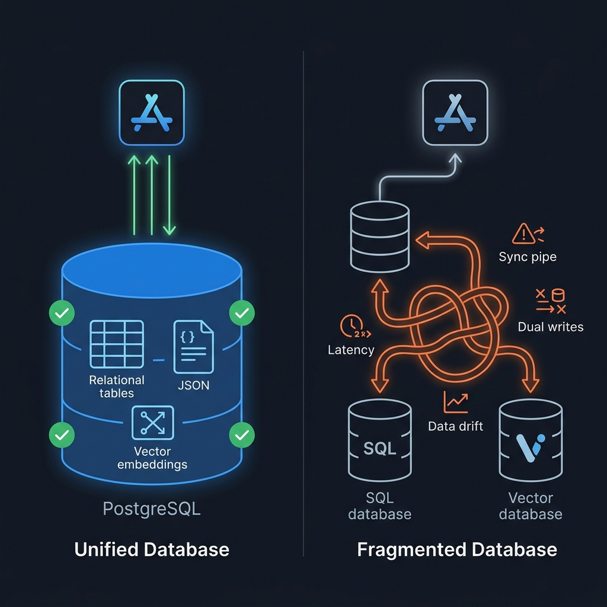

Tu equipo acaba de contratar una base de datos vectorial dedicada de **300€ al mes** para indexar 50.000 documentos de soporte técnico. El panel de control luce espectacular, la documentación promete escalabilidad a miles de millones de vectores y el equipo de producto celebra que ahora son "AI-native".

Sin embargo, en las sombras de la infraestructura, acaba de nacer una pesadilla operativa: ahora tenéis **dos fuentes de la verdad**. Cada vez que un usuario actualiza un documento en vuestra base de datos relacional principal, tenéis que ejecutar una sincronización asíncrona hacia la base de datos vectorial externa. Si esa sincronización falla en mitad de la noche, vuestro pipeline RAG recupera información obsoleta o inexistente. Habéis roto la coherencia transaccional (ACID), duplicado los costes de almacenamiento, añadido latencia de red en cada consulta y fragmentado los permisos de seguridad.

Todo para indexar 50.000 vectores que **vuestro PostgreSQL actual podía buscar en 8 milisegundos con una sola línea de SQL y coste cero adicional**.

En la línea de decisiones de arquitectura que hemos defendido a lo largo de este blog —desde la separación de responsabilidades en [RAG: 7 Antipatrones](/es/posts/rag_antipatrones/) hasta la simplicidad pragmática de nuestro [Stack de Productividad 2026](/es/posts/stack_productividad_2026/) con Supabase—, este artículo analiza el debate de infraestructura de datos más polarizante de la IA aplicada: **¿cuándo necesitas realmente una Vector DB especializada (Pinecone, Qdrant, Milvus, Weaviate) y cuándo PostgreSQL con `pgvector` es la decisión de ingeniería superior?**

### La Fiebre de las Bases de Datos Vectoriales

Para entender cómo llegamos hasta aquí, hay que recordar el auge de la IA generativa entre 2023 y 2024. Cuando los desarrolladores descubrieron que podían convertir texto en representaciones numéricas multidimensionales (*embeddings*) y buscar por proximidad geométrica, surgió una necesidad inmediata: ¿dónde guardamos y consultamos estos vectores de 1.536 dimensiones?

Una oleada de startups deep-tech levantó cientos de millones de dólares en capital riesgo prometiendo motores de búsqueda especializados creados desde cero para álgebra lineal y búsqueda del vecino más cercano (*Approximate Nearest Neighbor*, ANN). Nacieron Pinecone, Qdrant, Chroma, Weaviate y Milvus.

Las bases de datos vectoriales dedicadas hicieron un trabajo extraordinario evangelizando el mercado. Pero cometieron un error de predicción fundacional: **asumieron que las bases de datos relacionales consolidadas serían incapaces de adaptarse a la velocidad del ecosistema de IA**.

Se equivocaron por completo. En el ecosistema de código abierto, la extensión **`pgvector`** transformó a PostgreSQL —el motor de base de datos más maduro, robusto y probado del planeta— en una base de datos vectorial de clase mundial.



### El Coste Oculto de la Arquitectura Dual

La decisión de introducir una base de datos vectorial dedicada no es simplemente una factura más a final de mes. Es una **decisión de acoplamiento arquitectónico** que introduce cuatro problemas críticos:

#### 1. El Problema del Doble Escritura (Dual-Write Problem)
Cuando los datos residen en dos sistemas desconectados (tu base de datos SQL principal y tu Vector DB externa), una mutación requiere escribir en ambos sitios. ¿Qué ocurre si la escritura en PostgreSQL tiene éxito pero la llamada a la API de Pinecone da un timeout? El estado queda desincronizado. Para solucionarlo, tu equipo se ve obligado a implementar sistemas de colas de eventos (Kafka, RabbitMQ), patrones Outbox o pipelines CDC (*Change Data Capture*), añadiendo cientos de líneas de código y puntos de fallo.

#### 2. Pérdida de Transacciones ACID
En PostgreSQL, una transacción `BEGIN ... COMMIT` garantiza que los cambios son atómicos y consistentes. Si almacenas los vectores dentro de la misma tabla o en una tabla relacionada en PostgreSQL, el borrado de un documento y el borrado de su embedding suceden en la misma transacción atómica. En una Vector DB externa, la consistencia eventual es lo mejor a lo que puedes aspirar.

#### 3. Latencia de Red Distribuida
Una consulta RAG típica no solo busca vectores; filtra por metadatos: *"dame los fragmentos más relevantes del manual técnico, pero solo de la versión 2.4, creados después de enero de 2026 y que pertenezcan al tenant del usuario X"*.

En una arquitectura separada, el flujo es tortuoso:
1. Tu backend consulta a PostgreSQL para obtener los IDs autorizados del tenant.
2. Tu backend envía esos IDs como filtro a la Vector DB externa a través de Internet (añadiendo 50-150 ms de latencia de red).
3. La Vector DB ejecuta la búsqueda vectorial y devuelve los IDs de los chunks.
4. Tu backend vuelve a consultar a PostgreSQL para recuperar el texto completo y los metadatos relacionales asociados.

Con `pgvector`, todo ocurre en **una única consulta SQL en el mismo proceso de base de datos**.

#### 4. Fragmentación de Seguridad y RLS
Como analizamos en [Prompt Injection](/es/posts/prompt_injection/) y en el [EU AI Act](/es/posts/eu_ai_act/), el control de acceso a nivel de fila (*Row Level Security*, RLS) es una barrera no negociable para aplicaciones multi-inquilino (*multi-tenant*). En Supabase PostgreSQL, las políticas RLS garantizan que un usuario jamás pueda recuperar vectores pertenecientes a otra empresa, porque la seguridad se evalúa directamente en el motor de base de datos. En una Vector DB externa, tienes que recrear y mantener toda la lógica de autorización en la capa de aplicación.

### La Mecánica Interna de pgvector: HNSW vs IVFFlat

Para utilizar `pgvector` en producción con rigor ingenieril, es imprescindible comprender cómo indexa y busca en el espacio vectorial. `pgvector` soporta los dos algoritmos de indexación más potentes de la industria:

```sql
-- Activar la extensión pgvector
CREATE EXTENSION IF NOT EXISTS vector;

-- Crear una tabla con columna de embeddings de 1536 dimensiones (OpenAI / Vertex AI)
CREATE TABLE document_sections (
    id UUID PRIMARY KEY DEFAULT gen_random_uuid(),
    article_slug TEXT NOT NULL,
    section_title TEXT NOT NULL,
    content TEXT NOT NULL,
    category TEXT NOT NULL,
    embedding VECTOR(1536),
    created_at TIMESTAMPTZ DEFAULT NOW()
);
```

#### 1. Índice IVFFlat (Inverted File Flat)
IVFFlat divide el espacio vectorial en $K$ clústeres o listas mediante el algoritmo k-means. Durante la búsqueda, el algoritmo identifica los clústeres más cercanos al vector de consulta y solo busca dentro de esas listas, reduciendo drásticamente el espacio de búsqueda.

* **Ventajas**: Tiempo de construcción de índice muy rápido y uso mínimo de memoria RAM.
* **Desventajas**: Requiere que la tabla ya tenga datos representativos antes de crear el índice para que los clústeres se calculen correctamente. Menor precisión (*recall*) bajo alta dimensionalidad.

#### 2. Índice HNSW (Hierarchical Navigable Small World)
HNSW construye un grafo multidimensional jerárquico donde los nodos son vectores y las aristas conectan vectores cercanos. La búsqueda comienza en las capas superiores con saltos largos y desciende a las capas inferiores para una búsqueda local de alta precisión.

```sql
-- Crear un índice HNSW optimizado para distancia coseno
CREATE INDEX ON document_sections 
USING hnsw (embedding vector_cosine_ops)
WITH (m = 16, ef_construction = 64);
```

* **Ventajas**: Precisión sobresaliente (>98% de *recall*), velocidad de consulta ultrarrápida (unos pocos milisegundos) y no requiere entrenar el índice previamente: puedes insertar nuevos vectores en tiempo real y el grafo se actualiza dinámicamente.
* **Desventajas**: Mayor uso de memoria RAM y construcción de índice más lenta que IVFFlat.

En la inmensa mayoría de los casos de uso en producción, **HNSW es la opción predeterminada recomendada**.

### El Superpoder: Consultas Híbridas (SQL + Vector)

La ventaja más aplastante de `pgvector` sobre cualquier base de datos especializada es la capacidad de combinar álgebra relacional completa, operadores JSONB, filtros temporales y similitud vectorial en una única consulta limpia:

```sql
-- Búsqueda híbrida en Supabase / PostgreSQL
SELECT 
    id,
    section_title,
    content,
    1 - (embedding <=> $1) AS cosine_similarity
FROM document_sections
WHERE category = 'Inteligencia Artificial'
  AND created_at >= NOW() - INTERVAL '6 months'
ORDER BY embedding <=> $1
LIMIT 5;
```

El operador `<=>` calcula la distancia coseno en C nativo a nivel de CPU. En una sola sentencia, PostgreSQL aplica el filtro relacional (`category` y fecha) y realiza la búsqueda por vecinos más cercanos sobre el subconjunto resultante, resolviendo la consulta en **menos de 10 milisegundos**.

Intentar replicar esta consulta en una Vector DB separada requiere sincronizar los metadatos, lidiar con filtrados preliminares (*pre-filtering*) o posteriores (*post-filtering*) que degradan el recall, y pagar la penalización de múltiples saltos de red.

### Cuándo SÍ Necesitas una Base de Datos Vectorial Dedicada

La honestidad técnica exige reconocer cuándo una herramienta especializada supera a una generalista. Estas son las situaciones donde una base de datos vectorial dedicada (Qdrant, Milvus, Pinecone) es la elección arquitectónica justificada:

| Escenario | Usa PostgreSQL (`pgvector`) | Usa Vector DB Dedicada |
| :--- | :---: | :---: |
| **Volumen de vectores** | < 10 millones de vectores | > 50–100 millones de vectores |
| **Arquitectura de datos** | Monolito o microservicio con base de datos existente | Infraestructura de búsqueda desacoplada a gran escala |
| **Filtros requeridos** | Complejos (JOINs, JSONB, RLS, permisos relacionales) | Simples (filtros de clave-valor básicos) |
| **Hardware / Memoria** | Servidor estándar con memoria balanceada | Clúster distribuido optimizado exclusivamente para RAM/GPU |
| **Presupuesto operativo** | 0€ adicionales (incluido en tu base de datos) | 100€ – 2.000€+ al mes por clúster gestionado |
| **Sharding horizontal masivo** | Particionamiento estándar de PostgreSQL | Sharding automático y balanceo nativo entre decenas de nodos |

Si tu empresa no está indexando el catálogo de productos de Amazon o miles de millones de posts de una red social global, **estás en el territorio de pgvector**. Para el 95% de las aplicaciones corporativas, SaaS B2B, sistemas RAG de documentación técnica y agentes inteligentes, PostgreSQL maneja la carga sin despeinarse.

### Caso Real en Datalaria: El Ops Copilot y Supabase

En nuestro [Stack de Productividad](/es/posts/stack_productividad_2026/), documentamos cómo operamos la infraestructura de Datalaria sobre Supabase (PostgreSQL gestionado).

Cuando construimos el [Ops Engineering Copilot](/es/posts/ia_agents_part8/) para permitir a los lectores consultar semánticamente los más de 70 artículos de este blog:
1. Cada post se trocea en secciones semánticas delimitadas por encabezados Markdown (evitando el [Antipatrón 1 de RAG](/es/posts/rag_antipatrones/)).
2. Los embeddings se generan mediante la API de Gemini / Vertex AI (`text-embedding-004`).
3. Los vectores y el contenido se almacenan directamente en una tabla PostgreSQL con un índice HNSW sobre `pgvector`.
4. Cuando un usuario hace una pregunta, una función RPC en PostgreSQL ejecuta la búsqueda coseno y devuelve el contexto enriquecido en **menos de 12 ms**.

El coste de infraestructura para esta funcionalidad vectorial: **0€ adicionales**. Cero pipelines de sincronización. Cero servidores extra que monitorizar. Integridad transaccional absoluta.

### Conexión con la Economía de la IA y el EU AI Act

Este enfoque se alinea perfectamente con la [Regla del 10x](/es/posts/economia_oculta_ia/) que promulgamos en *La Economía Oculta de la IA*: **nunca adoptes una herramienta que añade complejidad operativa y coste recurrente a menos que te ofrezca un resultado 10 veces superior**. Una Vector DB dedicada no te da un resultado 10 veces mejor para un corpus de 100.000 documentos; te da exactamente el mismo resultado semántico con un 300% más de deuda técnica.

Asimismo, bajo el marco del [EU AI Act](/es/posts/eu_ai_act/) (Artículo 10 sobre gobernanza de datos y Artículo 12 sobre trazabilidad), mantener los datos de negocio, los registros de acceso y los embeddings en un único sistema unificado simplifica radicalmente las auditorías de cumplimiento. No tienes que justificar cómo viajan los datos entre proveedores ni cómo sincronizas los permisos de borrado bajo el RGPD / GDPR (*derecho al olvido*): un simple `DELETE FROM users WHERE id = X` en cascada elimina automáticamente al usuario, sus documentos y todos sus vectores asociados de forma inmediata y verificable.

### Conclusión: La Belleza de la Simplicidad Ingenieril

En la ingeniería de software moderna existe una tentación constante por coleccionar herramientas especializadas como si fueran cromos. Cada nueva categoría tecnológica parece exigir una nueva base de datos, un nuevo framework y una nueva suscripción SaaS.

Pero la verdadera elegancia de la ingeniería no reside en la complejidad acumulada, sino en la **máxima funcionalidad con la mínima superficie de fallo**.

PostgreSQL lleva más de 30 años evolucionando. Ha absorbido JSON (dejando atrás la necesidad de bases documentales para la mayoría de casos), ha absorbido datos geoespaciales con PostGIS, y con `pgvector` ha absorbido la búsqueda vectorial moderna.

Antes de abrir la tarjeta de crédito corporativa para contratar otro servicio gestionado de vectores, abre una conexión a tu base de datos PostgreSQL, ejecuta `CREATE EXTENSION vector;` y compruébalo por ti mismo. La solución más simple casi siempre resulta ser la más potente.

---

#### Fuentes de Interés:
* [**GitHub**: pgvector — Open-Source Vector Similarity Search for PostgreSQL](https://github.com/pgvector/pgvector)
* [**Supabase Docs**: Vector Columns and HNSW Indexing](https://supabase.com/docs/guides/database/extensions/pgvector)
* [**Jonathan Katz (AWS)**: How to Optimize HNSW Indexing in PostgreSQL](https://aws.amazon.com/blogs/database/optimize-hnsw-indexing-in-postgresql-with-pgvector/)
* [**Datalaria**: RAG en Producción — 7 Antipatrones que Destruyen la Precisión](/es/posts/rag_antipatrones/)
* [**Datalaria**: El Stack de Productividad de un Ingeniero en 2026](/es/posts/stack_productividad_2026/)
* [**Datalaria**: Fine-Tuning vs Prompt Engineering vs RAG](/es/posts/finetuning_vs_rag/)
* [**Datalaria**: La Economía Oculta de la IA — Costes Reales en Producción](/es/posts/economia_oculta_ia/)
* [**Datalaria**: EU AI Act — Trazabilidad y Gobernanza de Datos](/es/posts/eu_ai_act/)
