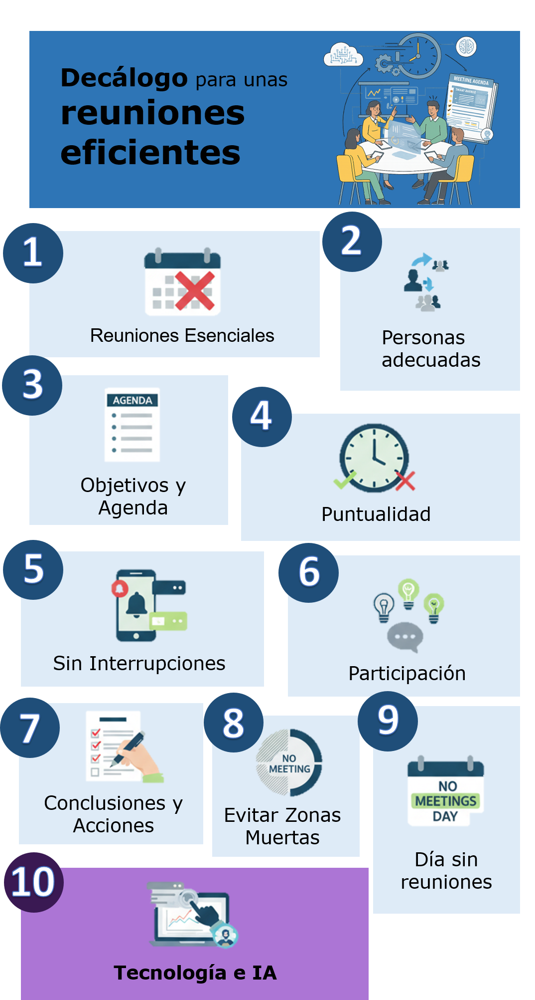

Si hay un elemento universal en el mundo profesional que genera tanto amor como odio, son las reuniones. Cuando son efectivas, pueden alinear equipos, desbloquear ideas y acelerar proyectos. Pero cuando no lo son, se convierten en agujeros negros de tiempo y energía que devoran nuestra productividad.

En una era donde el trabajo remoto e híbrido es la norma y las herramientas de inteligencia artificial están redefiniendo nuestras capacidades, dominar el arte de la reunión eficaz ya no es una habilidad deseable, es una necesidad estratégica. ¿La buena noticia? No se trata de magia, sino de método.

A continuación, presento un decálogo de 10 pasos prácticos para transformar nuestras reuniones, con un enfoque especial en cómo la tecnología, y en particular la IA, puede convertirse en nuestro mejor copiloto para lograrlo.

### El Decálogo para Reuniones Excelentes

#### 1. Reuniones Solo para lo Esencial
La primera regla de un buen sistema de reuniones es... tener menos reuniones. Antes de convocar, pregúntate: ¿Es realmente necesario? ¿Se puede resolver con un correo, un documento compartido o un mensaje rápido? Reserva el tiempo síncrono para debates, toma de decisiones complejas o sesiones de brainstorming que realmente requieran interacción en tiempo real.

#### 2. Convoca a las Personas Adecuadas (y Respeta su Agenda)
Una reunión con demasiados asistentes es una receta para la ineficiencia. Invita únicamente a quienes son esenciales para la toma de decisiones o cuya contribución es indispensable. Antes de fijar una hora, utiliza las herramientas de calendario para comprobar la disponibilidad de los asistentes clave y evitar conflictos innecesarios.

#### 3. Define Objetivos y una Agenda Clara (con 24h de Antelación)
Una reunión sin agenda es como un barco sin timón. La convocatoria debe incluir siempre el objetivo principal, la agenda detallada y la documentación previa. Enviar esto al menos 24 horas antes permite que los asistentes lleguen preparados y la reunión sea mucho más productiva.

#### 4. Empieza y Termina a la Hora (y si Puedes, Acorta)
La puntualidad es una muestra de respeto por el tiempo de todos. Comienza a la hora fijada, incluso si no han llegado todos, y termina a la hora prevista. Un truco profesional es programar reuniones de 25 o 50 minutos en lugar de 30 o 60, para dejar un pequeño margen entre compromisos.

#### 5. Sin Interrupciones: Foco Absoluto
Para que una reunión sea eficaz, requiere la atención plena de sus participantes. Establece como norma silenciar los teléfonos móviles y cerrar las aplicaciones de mensajería (Slack, Teams, etc.). El coste de la multitarea y las distracciones es mucho mayor de lo que pensamos.

#### 6. Aporta Ideas y Fomenta la Participación Activa
Una reunión no es una conferencia. El moderador debe asegurarse de que todas las voces sean escuchadas. Fomenta un ambiente de seguridad psicológica donde se puedan debatir ideas, no personas. La escucha activa es fundamental.

#### 7. Resume Conclusiones y Acciones al Finalizar
Los últimos 5 minutos de la reunión son los más importantes. Dedícalos a resumir verbalmente las decisiones clave, las acciones concretas, los responsables y las fechas límite. Esto asegura que todos salgan de la sala con la misma información.

#### 8. Evita las "Zonas Muertas" del Calendario
El momento en que se programa una reunión afecta directamente a la energía de los asistentes. Evita, siempre que sea posible, las reuniones a última hora de la tarde o a primera hora de la mañana. Las franjas a media mañana suelen ser las más productivas.

#### 9. Establece un "Día Sin Reuniones"
Una práctica cada vez más extendida y tremendamente eficaz. Consensúa con tu equipo un día a la semana o al mes en el que no se programen reuniones internas. Esto libera un bloque de tiempo ininterrumpido para el "trabajo profundo" (*deep work*).

#### 10. Usa la Tecnología (y la IA) como tu Copiloto Definitivo
La tecnología ya no es solo para conectar a personas en remoto, sino para hacer que todo el ciclo de vida de una reunión sea más inteligente y ágil. Aquí te presento un arsenal de herramientas y casos prácticos.

##### Antes de la Reunión: Planificación Inteligente

El éxito de una reunión empieza mucho antes de que se inicie.

* **Agendado Automático**: Olvídate del interminable cruce de correos para encontrar un hueco. Herramientas como [**Clockwise**](https://www.getclockwise.com/) o [**Motion**](https://www.usemotion.com/) analizan los calendarios de todo el equipo, encuentran el mejor momento para todos respetando sus bloques de trabajo profundo, e incluso reorganizan reuniones de forma inteligente si surge un conflicto.
* **Creación de Agendas con IA**: En lugar de empezar de cero, puedes pedirle a un asistente de IA que te ayude.
    * **Caso Práctico (Prompt para Gemini/ChatGPT)**: *"Genera una agenda detallada para una reunión de 60 minutos. El objetivo es decidir la estrategia de marketing para el lanzamiento del producto 'X'. Los asistentes son el Director de Marketing, un especialista en redes sociales y un analista de datos. Incluye tiempos para cada punto y preguntas clave a discutir."*

##### Durante la Reunión: Foco en la Conversación, no en las Notas

El objetivo es que los participantes se centren en debatir, no en transcribir.

* **Transcripción y Traducción en Tiempo Real**: Las principales plataformas ya lo integran. [**Google Meet**](https://workspace.google.com/intl/es/resources/ai-for-meetings/) (con Gemini) y [**Microsoft Teams**](https://www.microsoft.com/es-es/microsoft-teams/copilot-for-microsoft-365) (con Copilot) no solo transcriben la conversación, sino que pueden traducirla en tiempo real, eliminando barreras idiomáticas en equipos internacionales.
* **Asistentes Dedicados**: Herramientas como [**Otter.ai**](https://otter.ai/) o [**Fireflies.ai**](https://fireflies.ai/) actúan como un participante más en la reunión. Se unen a la llamada, graban el audio, lo transcriben y, lo más importante, identifican quién dijo qué. Esto es oro puro para el seguimiento posterior.

##### Después de la Reunión: Cierre y Seguimiento Automatizado

Aquí es donde la IA brilla con más fuerza, convirtiendo una conversación efímera en resultados tangibles.

* **Resúmenes y Análisis**: En lugar de releer toda la transcripción, herramientas como [**Read.ai**](https://www.read.ai/) generan automáticamente un resumen con los temas clave, las preguntas realizadas y hasta métricas de participación (quién habló más, sentimiento general de la reunión, etc.).
* **Extracción de Acciones y Decisiones**: Este es el superpoder definitivo. Puedes tomar la transcripción completa de Otter.ai o Google Meet, pegarla en un modelo de lenguaje avanzado y usar un prompt para que haga el trabajo pesado.
    * **Caso Práctico (Prompt para analizar una transcripción)**:
        > Actúa como un asistente de proyecto experto. Analiza la siguiente transcripción de una reunión y realiza tres tareas:
        > 1.  **Genera un resumen ejecutivo** en 5 puntos clave.
        > 2.  **Extrae una tabla con todas las acciones acordadas**. La tabla debe tener tres columnas: "Acción", "Responsable" y "Fecha Límite".
        > 3.  **Identifica las decisiones principales** que se tomaron durante la sesión.

* **Borrador de Actas y Correos**: Con la información extraída, puedes pedirle a la IA que redacte la comunicación final.
    * **Caso Práctico (Prompt de seguimiento)**: *"Basándote en el resumen y la tabla de acciones que acabas de generar, redacta un borrador de correo electrónico formal para enviar a todos los asistentes. El tono debe ser profesional y proactivo. Asegúrate de que las acciones y responsables queden muy claros."*

Al delegar estas tareas administrativas en la IA, no solo ahorramos horas de trabajo, sino que garantizamos un seguimiento riguroso y consistente, cerrando el ciclo de la reunión de manera impecable.

### Conclusión

Dominar el arte de las reuniones es una de las palancas de productividad más potentes que podemos accionar. Siguiendo este decálogo y apalancándonos en las increíbles capacidades de la IA, podemos transformar lo que a menudo es una fuente de frustración en un motor de claridad, alineación y progreso para nuestros equipos y proyectos.

---

#### Fuentes de Interés:
* [**Harvard Business Review**: Deje de perder el tiempo en reuniones](https://hbr.es/liderazgo/888/deje-de-perder-el-tiempo-en-reuniones) - Un análisis clásico y profundo sobre por qué fallan las reuniones y cómo solucionarlo.
* [**Google Workspace**: IA en reuniones y videoconferencias](https://workspace.google.com/intl/es/resources/ai-for-meetings/) - Página oficial de Google que detalla las funcionalidades de IA (Gemini) integradas en Google Meet.
* [**Microsoft Copilot para Teams**](https://www.microsoft.com/es-es/microsoft-teams/copilot-for-microsoft-365) - Descubre las capacidades del asistente de IA de Microsoft para sus reuniones.
* [**Otter.ai**](https://otter.ai/) y [**Fireflies.ai**](https://fireflies.ai/) - Dos de las herramientas líderes en transcripción y análisis de reuniones.
* [**Read.ai**](https://www.read.ai/es) - Un ejemplo de herramienta de IA que se integra con Zoom, Teams y Meet para generar resúmenes, transcripciones y métricas de participación.