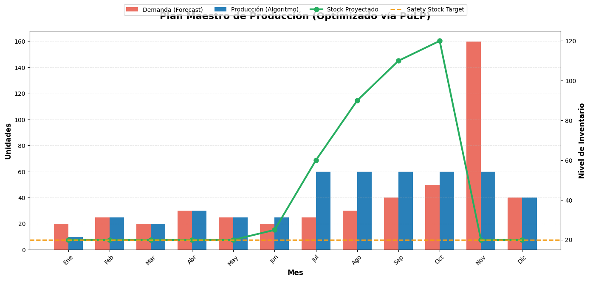

"Siempre queremos X semanas de cobertura." Esta frase, repetida como mantra en todas las reuniones de S&OP del planeta, es financieramente tóxica.

¿Por qué? Porque es una **regla fija aplicada a un sistema dinámico**. Si tu demanda en enero es 200 unidades y en julio es 20, te estás obligando a mantener 800 y 80 unidades respectivamente "por si acaso". En enero te queda corto. En julio inmovilizas capital sin motivo.

La alternativa no es intuición más sofisticada. Es **matemáticas**.

> **Resumen Ejecutivo:** En este capítulo, conectamos el forecast probabilístico del [Capítulo 2](/es/posts/sop-ingenieria-parte2-prediccion/) con un motor de Programación Lineal (PuLP) que calcula el plan de producción exacto que minimiza el coste total (producción + almacenamiento) respetando la restricción de Safety Stock. Pasamos de la predicción pasiva a la prescripción activa.

## Del Forecast a la Decisión: Arquitectura

En el [Capítulo 1](/es/posts/sop_ingenieria-higiene-datos/) limpiamos la señal. En el [Capítulo 2](/es/posts/sop-ingenieria-parte2-prediccion/) predijimos la demanda. Ahora damos el paso que Excel no puede dar: **optimizar**.

Nuestro pipeline en GitHub se conecta a Supabase, lee la tabla `demand_forecasts` (el futuro que predijimos), y genera una nueva tabla `supply_plans`. El sistema ha pasado de **descriptivo** (¿qué pasó?) a **predictivo** (¿qué pasará?) y ahora a **prescriptivo** (¿qué debo hacer?).

Esto es Investigación Operativa. La misma disciplina que optimiza rutas aéreas, logística militar y cadenas de suministro globales. Y la ejecutamos con 50 líneas de Python.

## Las Matemáticas del Negocio

No vamos a esconder las ecuaciones. Son el corazón de la decisión. Aquí está el fragmento central de nuestra clase `SupplyOptimizer`:

```python
# Función Objetivo: Minimizar coste total
problem += pulp.lpSum(
    production_cost * production[t] + holding_cost * inventory[t]
    for t in range(T)
), "Total_Cost"

# Restricción: Balance de Inventario (Ley de Conservación de Masas)
for t in range(T):
    prev_inv = initial_inventory if t == 0 else inventory[t - 1]
    problem += (
        inventory[t] == prev_inv + production[t] - demand[t],
        f"Balance_t{t}"
    )

# Restricción: Safety Stock (Política de Riesgo)
for t in range(T):
    problem += (
        inventory[t] >= safety_stock,
        f"SafetyStock_t{t}"
    )
```

Tres decisiones de ingeniería que merecen explicación:

**La Función Objetivo** no busca "tener mucho stock" ni "producir mucho". Busca el **mínimo coste financiero**: el equilibrio entre fabricar (caro) y almacenar (caro también). El solver encuentra automáticamente el punto exacto donde el coste combinado es mínimo.

**El Balance de Masas** es una restricción física: no puedes vender lo que no tienes. El inventario de hoy es el de ayer, más lo que fabricas hoy, menos lo que vendes. No hay magia. Las ecuaciones prohíben las trampas.

**El Safety Stock** es la política de riesgo: nunca permitas que el inventario baje por debajo de un mínimo de seguridad. En nuestro caso, 1,5 meses de demanda media. Esto lo calcula el sistema, no una hoja de cálculo con un número puesto a dedo.

## El Plan Maestro: De Algoritmo a Decisión de Negocio


*Esto es lo que el Director de Operaciones necesita ver. El algoritmo no fabrica uniformemente: si detecta un pico enorme de demanda en un periodo, decide "pre-construir" (pre-build) inventario en los meses anteriores para aplanar la carga de producción. Si el Holding Cost es alto, mantiene el almacén vacío y fabrica Just-in-Time. Excel no hace esto solo; las matemáticas sí.*

El resultado de nuestro solver con los datos de prueba:

- **Coste de producción:** 1.680 EUR
- **Coste de almacenamiento:** 540 EUR
- **Coste total optimizado:** 2.220 EUR

Este número no es una estimación. Es el **mínimo global demostrable** dadas las restricciones. Si alguien propone un plan más barato con los mismos parámetros, está violando alguna restricción.

## Open Kitchen: Juega con el Solver

Desconfío de las teorías que no se pueden poner en práctica. Por eso, he preparado un Google Colab donde puedes ejecutar el optimizador sobre un snapshot de nuestros datos reales.

El experimento más revelador: **cambia el `holding_cost` a un valor altísimo** (por ejemplo, 50 EUR/unidad). Observa cómo el algoritmo, automáticamente, decide fabricar Just-in-Time y mantener el almacén prácticamente vacío. Luego baja el coste de producción y mira cómo prefiere fabricar de golpe y almacenar. Las matemáticas se adaptan. Las reglas fijas de Excel, no.

📎 **[Abrir el Google Colab Interactivo](https://colab.research.google.com/drive/1fF9DY-eHL13G0AFg_geNxQ6duEMOWy4N?usp=sharing)**

Modifica los costes, las restricciones de capacidad, el Safety Stock. Haz ingeniería, no fe.

## La cadena completa: De Datos a Decisiones

Con este tercer capítulo, hemos construido un sistema S&OP end-to-end que va desde el CSV sucio del ERP hasta un plan de producción óptimo:


flowchart LR
    subgraph CAP1["Capitulo 1"]
        A["CSV Sucio"]
        B["Datos Limpios"]
    end

    subgraph CAP2["Capitulo 2"]
        C["Forecast Prophet"]
    end

    subgraph CAP3["Capitulo 3"]
        D["Plan Optimo PuLP"]
    end

    subgraph DB["Supabase"]
        E[("Single Source of Truth")]
    end

    A --> B --> E
    E --> C --> E
    E --> D --> E

    style A fill:#ff6b6b,stroke:#c0392b,color:#fff
    style B fill:#2ecc71,stroke:#27ae60,color:#fff
    style C fill:#3498db,stroke:#2980b9,color:#fff
    style D fill:#9b59b6,stroke:#8e44ad,color:#fff
    style E fill:#f39c12,stroke:#d35400,color:#fff


**Leyenda:**
- 🔴 **Rojo:** Datos crudos con ruido
- 🟢 **Verde:** Señal limpia
- 🔵 **Azul:** Predicción probabilística
- 🟣 **Púrpura:** Plan de suministro optimizado
- 🟠 **Naranja:** Base de datos centralizada (Supabase)

## Siguiente Paso: Escalando a Enterprise

Ya tenemos el plan perfecto en nuestra base de datos. Pero solo para un producto. ¿Qué pasa cuando metes 3 SKUs que comparten la misma fábrica?

En el [Capítulo 4](/es/posts/sop-ingenieria-parte4-enterprise/) rompemos el MVP: inyectamos datos multi-producto con perfiles radicalmente distintos, paralelizamos el forecasting con **MLOps**, y construimos un modelo unificado de Programación Lineal donde los productos *compiten matemáticamente* por la capacidad de producción compartida.

> La diferencia entre un Director de Operaciones que planifica y uno que optimiza es una función objetivo entre su intuición y la realidad.
