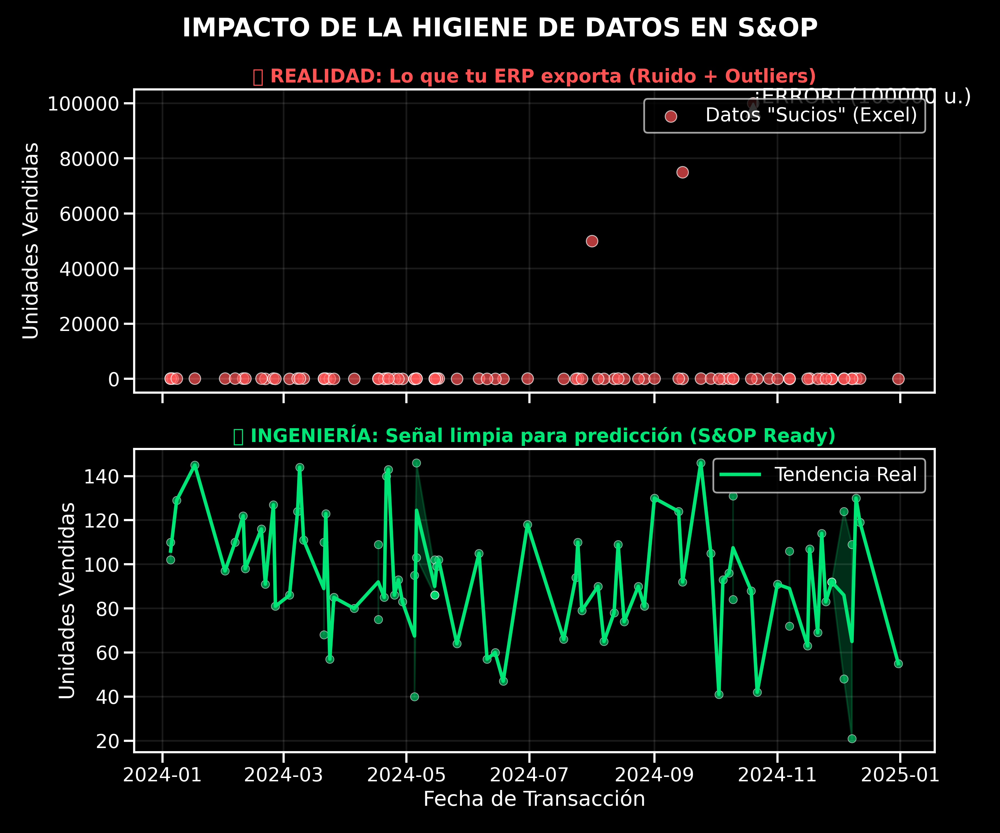

En las reuniones de S&OP (Sales & Operations Planning), a menudo se discute sobre opiniones en lugar de hechos. *"Creo que venderemos más"*, *"El mes pasado fue raro"*. 

El problema raíz no es la falta de visión comercial, es la **falta de integridad en la señal**.

La mayoría de las cadenas de suministro se gestionan sobre hojas de cálculo que aceptan cualquier cosa: fechas como texto, espacios en blanco, y errores de dedo que convierten un pedido de 100 unidades en 100.000. Cuando alimentas tu algoritmo de predicción con esa "basura", obtienes basura amplificada (El efecto *Bullwhip* financiero).

Hoy iniciamos la serie **Ingeniería del S&OP**. No vamos a hablar de teoría; vamos a construir una arquitectura de datos que audite tu negocio automáticamente.


## El Problema: Signal-to-Noise Ratio

En telecomunicaciones (mi background original), el ruido es cualquier interferencia que corrompe la señal. En Supply Chain, el "ruido" son los datos sucios.

Si no filtras el ruido antes de planificar la demanda, estás **inmovilizando capital**. Un *outlier* no detectado es dinero en llamas. Si tu algoritmo ve un pico falso de 100.000 unidades, ordenará materia prima que no necesitas, quemando caja y ocupando espacio en almacén. La higiene de datos no es 'limpieza', es protección del margen operativo.

### La Evidencia Visual

Antes de ver una sola línea de código, mira la diferencia entre lo que tu ERP exporta (arriba) y la realidad estadística de tu demanda (abajo).


*Arriba: Datos crudos con errores humanos. Abajo: La señal limpia lista para algoritmos de IA.*

## La Solución: Arquitectura de "Válvula de Calidad"

Para solucionar esto, aplicamos **First Principles Thinking**. No necesitamos "tener más cuidado" con el Excel. Necesitamos un sistema que matemáticamente **prohíba** la entrada de datos sucios a nuestra "Verdad Única".

Hemos diseñado un pipeline automatizado con el siguiente stack:

* **Cerebro:** Python (Pandas + Scipy) para la lógica estadística.
* **Almacén:** Supabase (PostgreSQL) como la "Verdad Única".
* **Agente:** Un script que se ejecuta automáticamente ante nuevos archivos.

### El Código: Estadística > Intuición

No usamos reglas fijas ("si es mayor que 1000, borra"). Usamos estadística. Implementamos el **Z-Score**, que mide cuántas desviaciones estándar se aleja un dato de la media.

Si una venta tiene un `Z-Score > 3` (está a más de 3 sigmas de la normalidad), es matemáticamente improbable que sea comportamiento estándar. El sistema no lo borra (podría ser una venta real), pero lo **marca para auditoría** y lo excluye de la predicción automática.

*Nota*: Usamos Z-Score asumiendo normalidad para simplificar este ejemplo. En escenarios de producción con demanda intermitente, utilizamos métodos como IQR (Interquartile Range) o MAD (Median Absolute Deviation) que son más robustos ante distribuciones no gaussianas.

Aquí está la lógica central de nuestra clase `SupplyChainSanitizer`:

```python
def detect_outliers_zscore(self, threshold=3):
    """
    Detecta anomalías estadísticas usando Z-Score.
    No borramos la fila (pérdida de info), la etiquetamos.
    """
    # Calculamos la desviación estándar de la señal
    z_scores = np.abs(stats.zscore(self.df['qty']))
    
    # Marcamos lo que es matemáticamente sospechoso
    self.df['is_outlier'] = z_scores > threshold
    return self
```

## Open Kitchen: Pruébalo tú mismo

Como ingeniero, desconfío de lo que no puedo ejecutar. Por eso, he aislado la lógica de limpieza en un [Notebook interactivo en Colab](https://colab.research.google.com/drive/16HGhPhUx4NGKnXHrtsF_xlJqU5qlnUVy?usp=sharing).

No necesitas instalar Python ni configurar bases de datos. He preparado un entorno efímero donde puedes:

* Generar un dataset de ventas corrupto (simulado).
* Ejecutar el motor de limpieza `SupplyChainSanitizer`.
* Ver cómo el algoritmo detecta y separa el ruido.

Haz clic en el botón, dale a "Play" en las celdas y observa la ingeniería de datos en acción.

## Arquitectura de Producción (Behind the Scenes)

Para los perfiles técnicos interesados en cómo esto escala en una empresa real (Datalaria Core):

* **Ingesta:** Los CSVs se suben a un Bucket privado en Supabase Storage o en una Base de datos local.
* **Trigger:** Un worker de Python detecta el archivo.
* **Proceso:** Ejecuta la limpieza en memoria (Docker Container).
* **Persistencia:** Los datos limpios se inyectan en PostgreSQL usando Row Level Security (RLS) para asegurar que nadie pueda alterar el histórico financiero manualmente.

> **Nota de Seguridad:** En producción, nunca conectamos scripts con permisos de superusuario. Usamos Service Roles específicos y políticas RLS estrictas para asegurar la integridad de la cadena de suministro.

### Visualización del Flujo de Datos

El siguiente diagrama muestra cómo los datos "sucios" pasan por nuestra **Válvula de Calidad** antes de llegar a la Verdad Única:


flowchart LR
    subgraph ORIGEN["📂 Origen"]
        A["CSV del ERP<br/>(Datos Sucios)"]
    end

    subgraph PIPELINE["🧠 Válvula de Calidad (Python)"]
        B["structural_clean()<br/>Fechas · Nulos · Duplicados"]
        C["detect_outliers()<br/>Z-Score σ > 3"]
        D["get_audit_report()<br/>Métricas de Higiene"]
    end

    subgraph DESTINO["🗄️ Verdad Única"]
        E[("Supabase<br/>PostgreSQL")]
        F["Datos Limpios<br/>(Señal Pura)"]
        G["Outliers Marcados<br/>(Para Auditoría)"]
    end

    A --> B --> C --> D
    D --> E
    E --> F
    E --> G

    style A fill:#ff6b6b,stroke:#c0392b,color:#fff
    style F fill:#2ecc71,stroke:#27ae60,color:#fff
    style G fill:#f39c12,stroke:#d35400,color:#fff
    style E fill:#3498db,stroke:#2980b9,color:#fff


**Leyenda:**
- 🔴 **Rojo:** Datos crudos con ruido (el problema)
- 🟢 **Verde:** Señal limpia lista para predicción
- 🟠 **Naranja:** Anomalías etiquetadas para revisión humana
- 🔵 **Azul:** Almacén centralizado (Supabase)

## Siguiente Paso: Predicción Científica

Ahora que tenemos una base de datos limpia (una señal pura), estamos listos para mirar al futuro.

En el próximo capítulo de la serie, conectaremos esta tabla limpia con **Facebook Prophet** para generar previsiones de demanda probabilísticas, abandonando para siempre las medias móviles simples de Excel.

Suscríbete para recibir el Capítulo 2: *"Demand Planning: De la Adivinación a la Probabilidad"*.