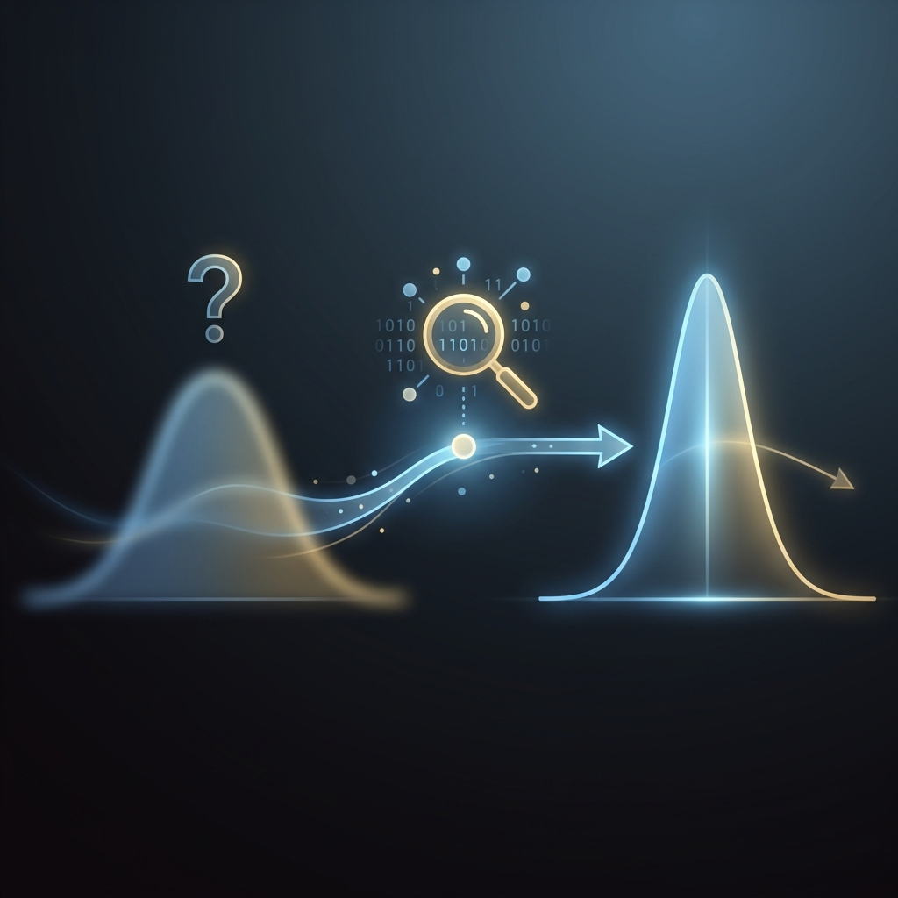

Hay una pregunta que todo profesional que trabaja con datos debería hacerse y que casi nadie se formula explícitamente: **¿Cómo debería cambiar mi opinión cuando recibo nueva evidencia?** No me refiero a una respuesta filosófica, sino a una matemática. Si creo que hay un 30% de probabilidad de que un componente electrónico quede obsoleto este año, y de repente recibo un email del proveedor anunciando una reducción de capacidad de producción, ¿cuánto debería subir mi estimación? ¿Al 50%? ¿Al 70%? ¿Cómo lo calculo de forma rigurosa?

La respuesta a esa pregunta la formuló un reverendo presbiteriano inglés en algún momento antes de 1761, y no se publicó hasta dos años después de su muerte. Su nombre era **Thomas Bayes**, y su ensayo póstumo es, sin exageración, uno de los documentos más influyentes en la historia de la ciencia. Desde los filtros anti-spam de tu correo electrónico hasta los modelos de predicción probabilística que utilizamos en la [serie de Ingeniería S&OP](/es/posts/sop-ingenieria-parte2-prediccion/) con Facebook Prophet, todo pasa por el Teorema de Bayes.

En la línea de figuras históricas que han dado forma a nuestra relación con los datos — [Florence Nightingale](/es/posts/florence-nightingale/) y la visualización, [John Snow](/es/posts/john-snow/) y la geolocalización, [Abraham Wald](/es/posts/abraham_wald/) y el sesgo del superviviente, [Kantorovich](/es/posts/kantorovich/) y la optimización, [Deming](/es/posts/deming/) y la calidad, [Claude Shannon](/es/posts/claude_shannon/) y la información — Bayes ocupa un lugar singular: nos enseñó a pensar en la **incertidumbre como algo cuantificable y actualizable**, no como un obstáculo, sino como materia prima.

### El Reverendo y el Ensayo Póstumo

Thomas Bayes nació en Londres en 1702 en el seno de una familia de disidentes religiosos. Su padre, Joshua Bayes, fue uno de los primeros ministros presbiterianos ordenados en Inglaterra. Thomas siguió los pasos de su padre, fue ordenado ministro y pasó la mayor parte de su vida como pastor en Tunbridge Wells, un tranquilo balneario al sureste de Londres.

Pero Bayes no era un pastor convencional. Era miembro de la **Royal Society** (elegido en 1742), lo que indica que su reputación matemática era reconocida por la élite científica de la época. Se sabe que publicó un trabajo defendiendo los fundamentos lógicos del cálculo de Newton, pero durante su vida fue una figura discreta, casi invisible en los grandes debates intelectuales de la Ilustración.

La historia podría haber olvidado por completo a Bayes si no fuera por su amigo **Richard Price**, un filósofo galés y matemático destacado. Tras la muerte de Bayes en 1761, Price encontró entre sus papeles un manuscrito inacabado titulado *"An Essay towards solving a Problem in the Doctrine of Chances"*. Price reconoció inmediatamente su importancia, lo completó, y lo presentó ante la Royal Society en 1763.

El problema que Bayes intentaba resolver era deceptivamente simple en su formulación y profundamente revolucionario en sus implicaciones: **dada una serie de observaciones, ¿cuál es la probabilidad de que la causa subyacente sea una u otra?** Es decir, ¿cómo invertimos la dirección de la probabilidad? No «dado que la moneda es justa, ¿cuál es la probabilidad de sacar 7 caras en 10 lanzamientos?», sino la pregunta inversa: «dado que he observado 7 caras en 10 lanzamientos, ¿cuál es la probabilidad de que la moneda sea justa?».

### El Teorema: Actualizar Creencias con Evidencia

El Teorema de Bayes puede expresarse sin fórmulas intimidantes usando tres conceptos intuitivos:

1. **Prior (Creencia previa)**: Lo que crees antes de ver los datos. Tu estimación inicial basada en experiencia, intuición o datos históricos. En un contexto S&OP, el *prior* podría ser: «Históricamente, vendemos unas 10.000 unidades de este producto en julio».

2. **Evidencia (Likelihood)**: Los datos nuevos que observas y la probabilidad de observar esos datos bajo diferentes hipótesis. Por ejemplo: «Este junio hemos recibido un 40% más de pedidos anticipados que el año pasado».

3. **Posterior (Creencia actualizada)**: Tu nueva estimación después de integrar la evidencia con tu creencia previa. El *posterior* combina matemáticamente lo que sabías antes con lo que los datos nuevos te dicen. No descarta tu experiencia previa ni se deja cegar por un solo dato nuevo: **pondera ambos**.

La belleza del enfoque bayesiano es que es **iterativo**: el *posterior* de hoy se convierte en el *prior* de mañana. Cada nuevo dato que recibes refina tu estimación. No es una fotografía estática; es una película que se actualiza fotograma a fotograma. Es exactamente la misma filosofía del ciclo PDCA de [W. Edwards Deming](/es/posts/deming/): planifica, ejecuta, verifica, ajusta. Repite.

### Conexión Moderna: Prophet y la Predicción de Demanda

¿Dónde aparece Bayes en la ingeniería de datos moderna? En prácticamente todas partes, pero la conexión más directa con este blog es **Facebook Prophet**, la herramienta que utilizamos en la [Parte 2 de la serie S&OP](/es/posts/sop-ingenieria-parte2-prediccion/) para generar forecasts probabilísticos de demanda.

Prophet es, en su núcleo, un **modelo aditivo bayesiano**. Descompone una serie temporal en tres componentes — tendencia, estacionalidad y efecto de festivos — y genera no una predicción puntual, sino un **intervalo de confianza**. Ese intervalo de confianza es, literalmente, una distribución posterior bayesiana: refleja la incertidumbre del modelo dada la evidencia histórica.

¿Por qué importa esto en la práctica? Porque el **Safety Stock** que calculamos en la [Parte 3 de la serie S&OP](/es/posts/sop-ingenieria-parte3-optimizacion/) — la cantidad de inventario de reserva para absorber la variabilidad de la demanda — se calcula sobre el límite superior de ese intervalo de confianza (típicamente al 95%). Si Prophet usara un modelo determinista (un solo número, sin incertidumbre), nuestro Safety Stock sería una adivinanza. Gracias a Bayes, es una **decisión fundamentada en la distribución de probabilidad de la demanda futura**.

El *prior* en este contexto es la experiencia acumulada del equipo de demand planning y los patrones históricos de la serie temporal. La *evidencia* son los nuevos datos que llegan cada semana o cada mes. El *posterior* es el forecast actualizado que alimenta el motor de [programación lineal de PuLP](/es/posts/sop-ingenieria-parte3-optimizacion/) para optimizar el plan de producción. Bayes está en el corazón de la cadena, aunque nunca se le mencione por su nombre en las reuniones de S&OP.

### Conexión Moderna: A/B Testing y Netflix

Cuando [Netflix](/es/posts/netflix/) decide qué carátula mostrar para una serie, ejecuta un A/B test masivo: muestra la versión A a millones de usuarios y la versión B a otros tantos, y mide cuál genera más clics. El enfoque clásico (frecuentista) requiere esperar hasta alcanzar un tamaño de muestra predeterminado para declarar un «ganador» con significancia estadística. Si haces *peeking* — mirar los resultados antes de tiempo —, invalidas el experimento.

El enfoque **bayesiano** para A/B testing elimina este problema. En lugar de un test binario de hipótesis (¿hay diferencia o no?), el A/B testing bayesiano calcula continuamente la **probabilidad de que la versión A sea mejor que la versión B** dado los datos observados hasta el momento. No necesitas esperar a un tamaño de muestra fijo porque la distribución posterior se actualiza con cada nuevo dato.

Esto tiene implicaciones prácticas enormes para startups y equipos con tráfico limitado. Si tu producto no tiene millones de usuarios, un test frecuentista puede tardar semanas o meses en ser concluyente. Un test bayesiano te da una estimación de probabilidad útil mucho antes, con la honestidad de decirte: «Con los datos actuales, hay un 78% de probabilidad de que A sea mejor que B». Tú decides si ese 78% es suficiente para actuar.

### Conexión Moderna: Filtros Anti-Spam y Clasificación

Uno de los primeros triunfos del machine learning en producción a escala fue el **filtro de spam bayesiano**. El algoritmo **Naive Bayes** (llamado «naive» porque asume independencia entre las palabras, una simplificación burda pero sorprendentemente efectiva) calcula la probabilidad de que un email sea spam dado las palabras que contiene.

El *prior* es la tasa base de spam (aproximadamente el 45% de todo el email global). La *evidencia* son las palabras del email: «oferta», «gratis», «urgente» aumentan la probabilidad posterior de spam; «reunión», «presupuesto», «adjunto» la reducen. Cada palabra actualiza la probabilidad, exactamente como Bayes prescribió hace 260 años.

La conexión con el [sesgo del superviviente de Abraham Wald](/es/posts/abraham_wald/) es directa: en un filtro de spam, los datos que **no ves** (emails legítimos que fueron filtrados erróneamente como spam) son tan importantes como los que ves. Si tu filtro tiene una alta tasa de falsos positivos, estás cometiendo el mismo error que los ingenieros de la WWII que solo analizaban los aviones que regresaban. Bayes y Wald, separados por dos siglos, están hablando del mismo problema: **la información ausente distorsiona tus conclusiones**.

### Conexión Moderna: Diagnóstico Médico y la Paradoja del Test Perfecto

Hay un ejemplo clásico de razonamiento bayesiano que debería ser obligatorio en la formación de todo ingeniero, porque destruye una intuición muy extendida. Supongamos que existe un test médico para una enfermedad rara (prevalencia: 1 de cada 10.000 personas). El test tiene una sensibilidad del 99% (detecta correctamente al 99% de los enfermos) y una especificidad del 99% (identifica correctamente al 99% de los sanos).

Pregunta: si das positivo en este test, **¿cuál es la probabilidad de que realmente estés enfermo?**

La respuesta intuitiva de la mayoría de las personas — incluidos muchos médicos — es «99%». La respuesta bayesiana correcta es aproximadamente **1%**. ¿Cómo es posible? Porque la prevalencia (el *prior*) es tan baja que, incluso con un test del 99%, la inmensa mayoría de los positivos son falsos positivos.

Este razonamiento es directamente aplicable a la ingeniería de sistemas de IA. Cuando configuramos alertas en el [radar de obsolescencia](/es/posts/obs_parte5_radar/) o en cualquier sistema de monitoreo, la tasa de falsos positivos es el enemigo silencioso. Un sistema de detección de anomalías con un 99% de precisión puede generar cientos de alertas falsas si la tasa base de anomalías reales es muy baja. Bayes nos obliga a pensar en el *prior* antes de celebrar la precisión del *test*.

### El Legado: Pensar en Distribuciones, No en Puntos

La contribución más profunda de Thomas Bayes no fue una fórmula; fue un **cambio de mentalidad**. Antes de Bayes, la probabilidad se concebía como una propiedad fija de los objetos: una moneda tiene un 50% de probabilidad de caer cara, punto. Después de Bayes, la probabilidad se convirtió en una medida de **nuestro grado de conocimiento** sobre el mundo, que se actualiza continuamente con nueva evidencia.

Esta distinción es la diferencia entre un ingeniero que dice *"la demanda de julio será de 10.000 unidades"* y uno que dice *"la demanda de julio tiene un 95% de probabilidad de estar entre 8.500 y 11.500 unidades, y nuestro plan de producción debe absorber esa variabilidad"*. El primero opera con certezas falsas; el segundo, con incertidumbre cuantificada. El primero es vulnerable al *bullwhip effect* que [destruye las cadenas de suministro](/es/posts/sop_ingenieria-higiene-datos/); el segundo está blindado contra él.

En un mundo donde los modelos de IA son estocásticos por naturaleza — como documentamos dolorosamente en el [post-mortem del Autopilot](/es/posts/ia_agents_part9/), donde el mismo pipeline produce resultados diferentes en cada ejecución —, pensar bayesianamente no es una opción filosófica: es una necesidad operativa. No preguntes «¿cuál es la respuesta?». Pregunta «¿cuál es la distribución de respuestas posibles, y con qué confianza?».

Un reverendo del siglo XVIII, trabajando en soledad con pluma y tinta en un pueblo termal inglés, resolvió un problema que hoy mueve la medicina, el marketing, la ciberseguridad, la cadena de suministro y la inteligencia artificial. Y lo hizo con una idea tan simple que cabe en una frase: **actualiza lo que crees con lo que observas**. Doscientos sesenta años después, seguimos sin encontrar un consejo mejor.

---

#### Fuentes de Interés:
* [**Stanford Encyclopedia of Philosophy**: Bayes' Theorem — Fundamentos y Contexto Histórico](https://plato.stanford.edu/entries/bayes-theorem/)
* [**Royal Society**: Thomas Bayes — Fellow Profile](https://royalsociety.org/people/thomas-bayes-11313/)
* [**3Blue1Brown**: Bayes' theorem, the geometry of changing beliefs (YouTube)](https://www.youtube.com/watch?v=HZGCoVF3YvM)
* [**Datalaria**: Estadística Descriptiva — Fundamentos de Análisis de Datos](/es/posts/Estadistica-descriptiva/)
* [**Datalaria**: S&OP Part 2 — Demand Planning con Prophet (Modelo Bayesiano)](/es/posts/sop-ingenieria-parte2-prediccion/)
* [**Datalaria**: Abraham Wald — La Epistemología de los Datos Ausentes](/es/posts/abraham_wald/)
* [**Datalaria**: Netflix — Cómo los Datos Forjan un Imperio (A/B Testing)](/es/posts/netflix/)
* [**Datalaria**: Claude Shannon — La Entropía como Incertidumbre](/es/posts/claude_shannon/)
