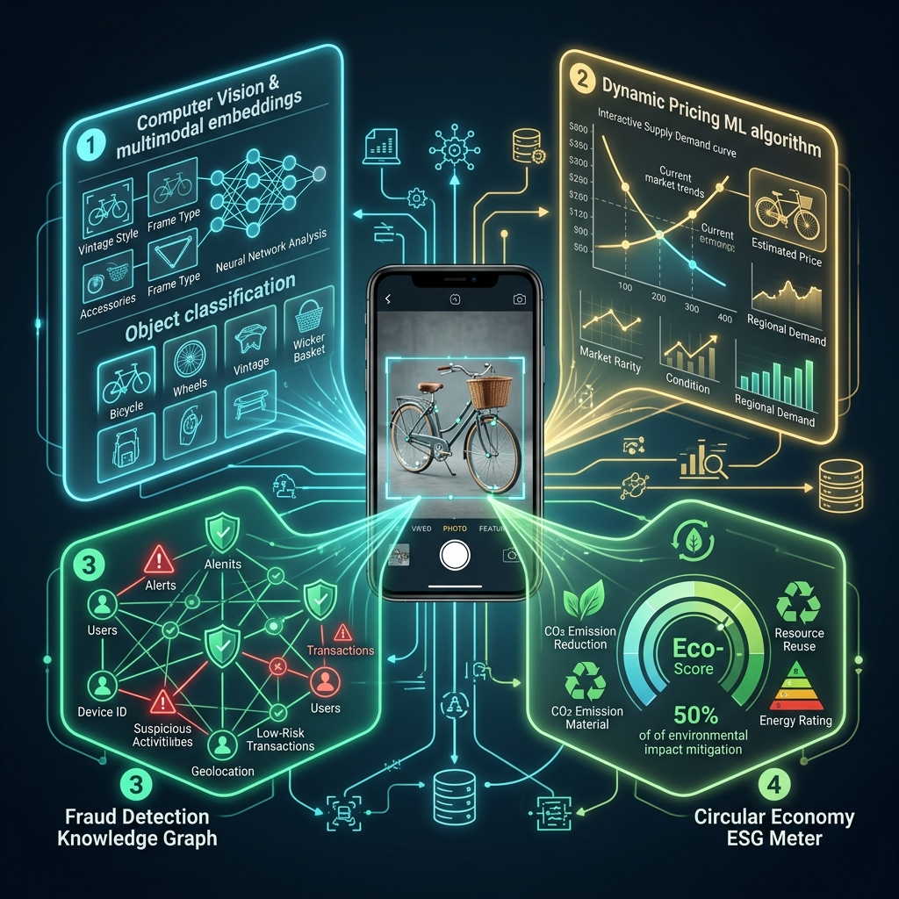

Subes una foto de una bicicleta antigua o de un smartphone usado a Wallapop. En menos de **200 milisegundos**, sin que el usuario perciba el más mínimo retraso, se desencadena una cascada de microservicios y modelos de Machine Learning en tiempo real:

1. Un modelo de visión artificial analiza los píxeles de la imagen, extrae marca, modelo y estado estético, y asigna automáticamente la taxonomía del catálogo.
2. Un algoritmo de pricing dinámico evalúa el histórico de transacciones cerradas, la oferta competidora en un radio de 5 kilómetros y la elasticidad de la demanda para sugerirte un rango de precio de venta óptimo.
3. Un motor de grafos de conocimiento analiza la huella del dispositivo, el patrón de comportamiento de la cuenta y los metadatos de la red para verificar que no se trata de un intento de estafa o un artículo robado.
4. Un modelo de contabilidad ambiental calcula las toneladas de dióxido de carbono (CO₂), los litros de agua y los kilogramos de materias primas que se ahorrarán si ese objeto encuentra un segundo dueño en lugar de fabricarse nuevo.

Para el usuario común, Wallapop es simplemente una aplicación móvil intuitiva donde comprar y vender cosas usadas en su barrio. Pero para un ingeniero de datos, Wallapop es **uno de los sistemas distribuidos de Machine Learning, visión por computador y análisis de grafos más complejos y de mayor escala de Europa**.

Continuando con nuestra serie de análisis en profundidad de las grandes tecnológicas nacidas en España —tras estudiar el procesamiento masivo de logs en [Devo](/es/posts/devo/), la analítica geoespacial en [Carto](/es/posts/carto/), las finanzas sostenibles en [Clarity AI](/es/posts/clarity_ai/), la optimización de retail en [Nextail](/es/posts/nextail/) y las pasarelas de pago globales en [Flywire](/es/posts/flywire/)—, este artículo disecciona la ingeniería invisible de Wallapop, su evolución tecnológica y el hito de su adquisición por el gigante tecnológico surcoreano **NAVER**.



### El Origen: De un Garaje en Barcelona a Dominar el Sur de Europa

A principios de 2013, el mercado español de clasificados online estaba dominado por plataformas web heredadas de la década de los 2000: *Segundamano.es*, *Milanuncios* y *eBay*. Eran páginas web lentas, diseñadas para ordenadores de sobremesa, que exigían rellenar formularios interminables y enviar correos electrónicos a vendedores anónimos en otras provincias.

Los fundadores de Wallapop —**Agustín Gómez, Gerard Olivé y Miguel Vicente** (nacidos al calor de la incubadora Antai Venture Builder en Barcelona)— comprendieron una verdad estructural que cambiaría el comercio digital: **el smartphone no era un ordenador pequeño; era un dispositivo con cámara de alta resolución, GPS en tiempo real y mensajería instantánea**.

Bajo el nombre inicial de *Fleapop*, la tesis fue radical en su simplicidad:
* **Mobile-Only**: Subir un producto debía costar menos de 30 segundos (hacer una foto, poner un título y fijar un precio).
* **Hiperlocalidad**: Gracias al GPS del teléfono, los compradores descubrían primero los objetos que estaban en su misma calle o barrio, permitiendo el intercambio en mano en efectivo y eliminando la fricción del transporte.
* **Chat Integrado**: La negociación se trasladó de hilos de correo opacos a un chat en tiempo real similar a WhatsApp.

El crecimiento fue explosivo. En apenas tres años, Wallapop pulverizó a los gigantes tradicionales de clasificados en España, expandió sus operaciones a **Italia y Portugal**, y consolidó una comunidad que hoy supera los **19 millones de usuarios activos mensuales**, con más de **100 millones de productos catalogados** y un volumen transaccional de miles de millones de euros.

### El Hito Corporativo: La Adquisición por el Gigante Surcoreano NAVER

La madurez tecnológica y el liderazgo indiscutible de Wallapop en la economía circular del sur de Europa no pasaron desapercibidos en el panorama tecnológico global. En 2021, **NAVER** —el mayor gigante de Internet y servicios tecnológicos de Corea del Sur, creador de la aplicación de mensajería *Line*, de la plataforma de cómics *Webtoon* y propietario del marketplace estadounidense *Poshmark*— inició una alianza estratégica invirtiendo 115 millones de euros en la compañía española.

Esta alianza culminó con la **adquisición mayoritaria de Wallapop por parte de NAVER**, valorando a la compañía española en más de **800 millones de euros** y consolidando una de las mayores operaciones corporativas en la historia del ecosistema startup español.

Para NAVER, Wallapop no era solo una cuota de mercado europea; era una joya de **ingeniería de datos hiperlocal y economía circular (C2C)** que complementa su red global de comercio electrónico entre particulares en Asia, Estados Unidos y Europa.

### Los 4 Pilares de la Arquitectura de Machine Learning de Wallapop

Operar un marketplace donde millones de usuarios suben diariamente fotos no estandarizadas (fotos oscuras, desenfocadas, con fondos caóticos) y descripciones incompletas es una pesadilla de ingeniería de datos. Wallapop resuelve este reto mediante cuatro motores tecnológicos fundamentales:

#### 1. Búsqueda Visual y Embeddings Multimodales
Cuando un usuario busca *"chaqueta de cuero vintage"* o sube una foto de una lámpara sin saber su nombre de fabricante, el motor de búsqueda no puede depender de coincidencias de texto exactas.

Wallapop utiliza arquitecturas de **redes neuronales convolucionales (CNNs) y Vision Transformers (ViT)** combinadas con modelos multimodales (similares a CLIP) que proyectan tanto imágenes como texto en un mismo espacio vectorial de alta dimensionalidad.
* Cada foto subida se convierte en un vector de características que captura forma, textura, color y categoría.
* Mediante índices vectoriales aproximados (como los índices HNSW que analizamos en [PostgreSQL con pgvector](/es/posts/pgvector_vs_vectordb/)), el sistema recupera productos visualmente idénticos o complementarios en menos de **15 milisegundos**.
* Además, el modelo ejecuta **auto-categorización**: detecta si el objeto es un vehículo, un instrumento musical o un mueble, sugiriendo al vendedor los atributos técnicos requeridos sin intervención manual.

#### 2. Pricing Dinámico y Estimación de Valor de Mercado
Uno de los mayores motivos de abandono en marketplaces C2C es la incertidumbre del precio: los vendedores sobrevaloran sus posesiones por sesgo de apego emocional, y los compradores rechazan productos fuera de mercado.

Wallapop implementa un motor de **Machine Learning de pricing algorítmico** entrenado sobre más de diez años de histórico de transacciones reales (no precios de oferta, sino precios reales de cierre en chat y pasarela de pago):
* El modelo calcula la **elasticidad precio-demanda** en función de la oferta local existente en la misma ciudad y el estado cosmético del producto.
* Sugiere en tiempo real una horquilla de precio *"Rápido"* (venta en <48 horas) o *"Justo"* (venta en 7-14 días), optimizando la liquidez del catálogo.

#### 3. Detección de Fraude en Tiempo Real mediante Grafos de Conocimiento
En un marketplace entre particulares, la confianza es la infraestructura más crítica. La plataforma se enfrenta constantemente a intentos de estafa: venta de artículos falsificados, intentos de desviar el pago fuera de la plataforma (*phishing*) y creación masiva de cuentas fantasma.

Para combatir el fraude sin degradar la experiencia de los usuarios legítimos, Wallapop combina procesamiento de lenguaje natural (NLP) con **Knowledge Graphs (Grafos de Conocimiento)**:
* El sistema modela usuarios, números de teléfono, tarjetas de crédito, direcciones IP, identificadores de dispositivo (*device fingerprints*) y conversaciones de chat como nodos y aristas de un grafo relacional.
* Si una cuenta recién creada comparte huella digital o patrones de red con una red de fraude identificada previamente, los algoritmos de detección comunitaria aíslan la cuenta y bloquean la publicación antes de que el anuncio sea visible.
* Modelos de NLP analizan el texto del chat en tiempo real para alertar al usuario si un comprador sospechoso intenta solicitar su número de teléfono o un enlace de pago externo.

#### 4. Contabilidad Ambiental y Métricas ESG Cuantificadas
A diferencia de los marketplaces tradicionales de comercio lineal que fomentan la sobreproducción, Wallapop opera sobre la premisa de la **economía circular**: cada producto reutilizado evita la extracción de nuevas materias primas y las emisiones asociadas a su fabricación y transporte internacional.

Para convertir este principio en un valor corporativo verificable bajo los estándares de sostenibilidad europeos (en estrecha sintonía con la filosofía de [Clarity AI](/es/posts/clarity_ai/)), Wallapop desarrolló una metodología científica de contabilidad de impacto:
* Cruzando las categorías de productos vendidos con bases de datos de análisis de ciclo de vida (LCA), la plataforma cuantifica anualmente el ahorro neto de emisiones de CO₂, consumo de agua y generación de residuos plásticos y metálicos.
* Solo en los últimos ejercicios, la reutilización de productos en Wallapop ha evitado la emisión de cientos de miles de toneladas de CO₂, transformando las métricas de impacto ambiental en un indicador de rendimiento clave (KPI) de la compañía.

---

### Tabla Comparativa: Las Startups Tecnológicas Españolas Analizadas en Datalaria

Con la incorporación de Wallapop, el cuadro de honor de las grandes tecnológicas españolas cubiertas en este blog se consolida como un mapa integral de la innovación en datos e ingeniería:

| Compañía | Fundación / Sede | Dominio Tecnológico | Modelo de Negocio | Hito Corporativo Clave |
| :--- | :---: | :--- | :--- | :--- |
| **Devo** | 2011 / Madrid–Boston | Ingesta y analítica de logs en tiempo real a escala petabyte | B2B SaaS Enterprise / Ciberseguridad | Unicornio español ($1.5B+ valoración) |
| **Flywire** | 2011 / Valencia–Boston | Pasarelas de pago transfronterizo complejas con ML | Fintech B2B2C (Educación, Salud, Viajes) | Cotizada en NASDAQ ($FLYW) |
| **Carto** | 2012 / Madrid–NY | Inteligencia geoespacial (Location Intelligence) y Spatial SQL | B2B Cloud Analytics | Referente global en analítica geoespacial |
| **Clarity AI** | 2017 / Madrid–NY | IA para scoring y análisis de sostenibilidad ESG | B2B SaaS Fintech / Inversión de impacto | Alianzas globales con BlackRock y BNP Paribas |
| **Nextail** | 2014 / Madrid | Optimización de inventario en retail con analítica prescriptiva | B2B SaaS Retail / Supply Chain | Operando en retailers globales en 30+ países |
| **Freepik** | 2010 / Málaga | Banco de recursos gráficos y modelos fundacionales GenAI | B2C/B2B Freemium / GenAI | Adquirida por EQT, líder mundial en microstock |
| **Multiverse Computing** | 2019 / San Sebastián | Algoritmos tensoriales cuánticos para compresión de LLMs | B2B Deep Tech / Computación Cuántica | Líder europeo en software cuántico industrial |
| **Wallapop** | 2013 / Barcelona | Visión artificial, pricing dinámico y grafos en economía circular | C2C/B2C Marketplace / Envíos y Pagos | **Adquisición mayoritaria por NAVER (>800M€)** |

---

### 5 Lecciones de Ingeniería y Producto de Wallapop

El recorrido de Wallapop ofrece lecciones universales para cualquier equipo que diseñe arquitecturas de datos y productos de consumo masivo:

#### 1. Diseña para la Fricción Cero en la Captura de Datos
El éxito inicial de Wallapop no fue su algoritmo de búsqueda; fue hacer que subir un producto costara tres clics desde el teléfono. Si el proceso de ingesta de datos es pesado, el catálogo no crece. Toda la sofisticación de Machine Learning posterior se alimenta de haber garantizado una ingesta masiva y fluida en el origen.

#### 2. La Confianza es una Decisión de Infraestructura
En plataformas peer-to-peer, la seguridad no puede ser un filtro manual a posteriori. Implementar grafos de conocimiento, verificación de identidad en pasarelas de pago y análisis de patrones en tiempo real es lo que permite escalar a 19 millones de usuarios sin que la plataforma se convierta en un entorno hostil.

#### 3. Los Modelos deben Operar en Tiempo Real (Baja Latencia)
Un modelo de visión artificial o un algoritmo de precios que tarda 3 segundos en responder arruina la experiencia móvil. Optimizar los modelos mediante cuantización, pipelines de [MLOps](/es/posts/mlops_para_ingenieros/) y bases de datos vectoriales optimizadas es el puente que separa un experimento de laboratorio de un producto en producción.

#### 4. La Hiperlocalidad Crea Efectos de Red Inexpugnables
Los grandes competidores globales (como eBay o Amazon) tenían más capital, pero no podían competir con la densidad hiperlocal de usuarios en un barrio de Madrid o Barcelona. El efecto red local genera una barrera de entrada que el dinero por sí solo no puede comprar.

#### 5. La Sostenibilidad Debe Medirse con Datos Duros
El discurso de la economía circular solo es creíble si se sustenta en métricas de datos auditables. Cuantificar el impacto ambiental con análisis de ciclo de vida convierte la sostenibilidad de un eslogan de marketing a una ventaja competitiva de producto y compliance regulatorio bajo el [EU AI Act](/es/posts/eu_ai_act/).

---

### Conclusión

Wallapop es la demostración palpable de que la tecnología más sofisticada es aquella que resulta completamente invisible para el usuario final. Detrás de una sencilla transacción de barrio para comprar una cafetera o unos patines de segunda mano, late un ecosistema de visión computacional, grafos distribuidos y analítica predictiva de vanguardia.

Su adquisición por parte de NAVER no solo corona una de las historias de éxito empresarial más inspiradoras de España, sino que ratifica que la intersección entre **la inteligencia artificial aplicada, la economía circular y la experiencia de usuario centrada en el móvil** es el modelo que definirá el futuro del comercio digital en la próxima década.

---

#### Fuentes de Interés:
* [**Wallapop**: Sala de Prensa — NAVER adquiere la plataforma de reutilizados Wallapop](https://about.wallapop.com/naver-el-gigante-de-internet-de-corea-del-suradquiere-la-plataforma-de-reutilizados-wallapop/)
* [**YouTube**: La HISTORIA y la VENTA de WALLAPOP](https://www.youtube.com/watch?v=8D16y-MtHgk)
* [**Wallapop About**: Brand Book e Identidad Corporativa](https://about.wallapop.com)
* [**Datalaria**: Clarity AI — La Revolución de la Sostenibilidad ESG](/es/posts/clarity_ai/)
* [**Datalaria**: Flywire — Fintech Española y Pasarelas de Pago Globales](/es/posts/flywire/)
* [**Datalaria**: Devo — Ingesta Masiva de Datos y Ciberseguridad](/es/posts/devo/)
* [**Datalaria**: Nextail — Analítica Prescriptiva e Inventarios](/es/posts/nextail/)
* [**Datalaria**: Carto — Inteligencia Geoespacial y Location Intelligence](/es/posts/carto/)
* [**Datalaria**: PostgreSQL con pgvector vs Vector DBs](/es/posts/pgvector_vs_vectordb/)
* [**Datalaria**: MLOps para Ingenieros — De Jupyter a Producción](/es/posts/mlops_para_ingenieros/)
* [**Datalaria**: EU AI Act — Guía para Ingenieros](/es/posts/eu_ai_act/)
