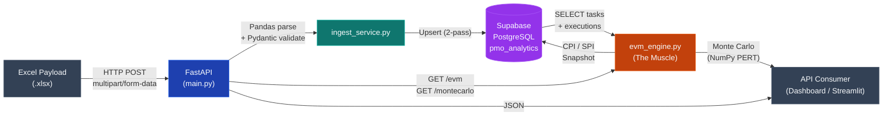
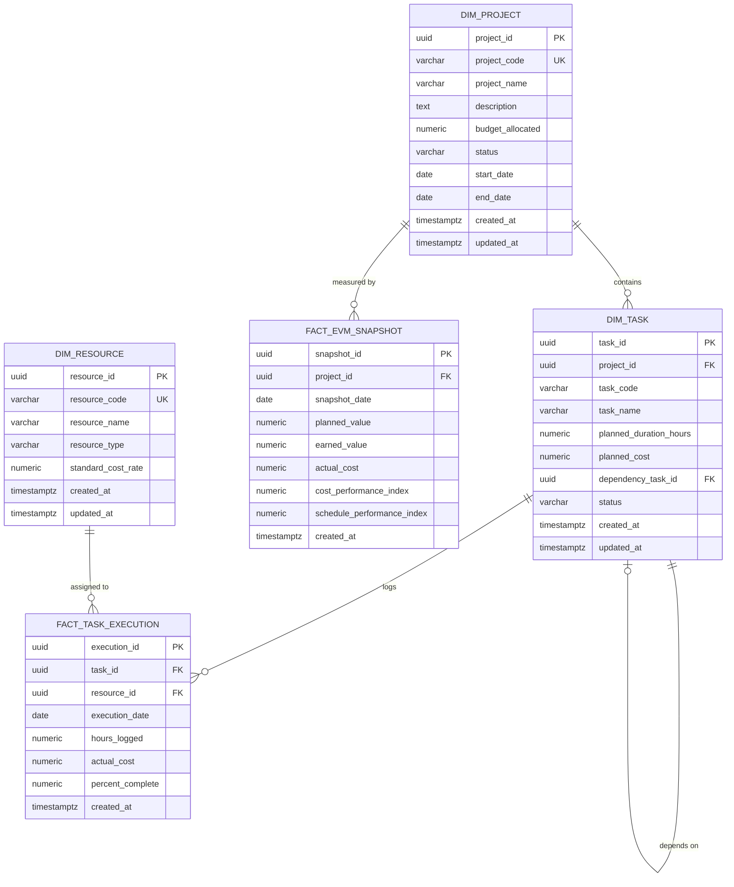

# Agentic PMO Sandbox — Technical Specification

**Version:** 1.0.0  
**Stack:** FastAPI · Pandas · NumPy · Supabase (PostgreSQL) · Pydantic  
**Location:** `static/apps/project-ops/`

---

## 1. File Manifest

| File | Role |
|---|---|
| `config.py` | Environment loader and Supabase client singleton. Fails hard if credentials are missing. |
| `models.py` | Strict Pydantic v2 contracts for inbound Excel payloads (`ProjectPayload`, `ResourcePayload`, `TaskPayload`) and outbound API responses (`EVMSnapshot`, `MonteCarloResult`). |
| `db_tools.py` | Pure data access layer. CRUD operations against the 5 tables of the `pmo_analytics` Kimball star schema. Zero business logic. |
| `ingest_service.py` | Excel parsing engine. Reads `.xlsx` via Pandas, validates against Pydantic models, and executes two-pass transactional upserts into Supabase (second pass resolves WBS dependency codes to UUIDs). |
| `evm_engine.py` | **The Muscle.** Earned Value Management calculator (CPI/SPI) and Monte Carlo schedule simulator (PERT distributions, 10K iterations). Pure Pandas/NumPy. |
| `main.py` | FastAPI async entrypoint. CORS-enabled. Exposes ingestion, EVM, Monte Carlo, and utility endpoints on port `8001`. |
| `generate_sample_excel.py` | Generates `sample_project.xlsx` — a realistic test payload ("Titanium Chassis Assembly Line", 10 WBS tasks, 5 resources, €2.5M budget). |
| `requirements.txt` | Pinned dependencies for the full stack. |
| `.env.example` | Template for `SUPABASE_URL` and `SUPABASE_KEY`. |

---

## 2. System Architecture



---

## 3. Data Model (ER Diagram)

Schema: `pmo_analytics` — Kimball Star Schema.



---

## 4. API Contracts

Base URL: `http://localhost:8001`

### 4.1 `POST /api/v1/ingest/excel`

Ingests an Excel payload into the Kimball star schema.

**Request:** `multipart/form-data`

| Field | Type | Description |
|---|---|---|
| `file` | `.xlsx` binary | Excel with sheets: `Project`, `Resources`, `Tasks` |

**Response (200):**

```json
{
  "status": "success",
  "project_id": "a1b2c3d4-...",
  "resources_inserted": 5,
  "tasks_inserted": 10,
  "message": "Project 'PROJ-TITAN-001' ingested. 5 resources, 10 WBS tasks loaded."
}
```

---

### 4.2 `GET /api/v1/evm/{project_id}`

Calculates a real-time EVM snapshot.

**Query Parameters:**

| Param | Type | Default | Description |
|---|---|---|---|
| `snapshot_date` | `YYYY-MM-DD` | Today | Cut-off date for calculations |

**Response (200):**

```json
{
  "project_id": "a1b2c3d4-...",
  "snapshot_date": "2026-06-15",
  "planned_value": 625000.00,
  "earned_value": 580000.00,
  "actual_cost": 610000.00,
  "cpi": 0.9508,
  "spi": 0.9280
}
```

---

### 4.3 `GET /api/v1/montecarlo/{project_id}`

Runs a PERT-based Monte Carlo schedule simulation.

**Query Parameters:**

| Param | Type | Default | Range | Description |
|---|---|---|---|---|
| `iterations` | `int` | `10000` | 1K–100K | Simulation iterations |

**Response (200):**

```json
{
  "project_id": "a1b2c3d4-...",
  "iterations": 10000,
  "p50_completion_days": 142.3,
  "p85_completion_days": 158.7,
  "p95_completion_days": 171.2,
  "probability_on_time": 0.6234,
  "cost_overrun_expected": 185400.00
}
```

---

## 5. Mathematical Engine (`evm_engine.py`)

### 5.1 Earned Value Management (EVM)

Three base metrics computed per snapshot date:

| Metric | Formula | Source |
|---|---|---|
| **Planned Value (PV)** | `total_planned_cost × (elapsed_days / total_days)` | Linear interpolation from `dim_project` dates |
| **Earned Value (EV)** | `Σ (planned_cost_i × percent_complete_i)` | Latest `percent_complete` per task from `fact_task_execution` |
| **Actual Cost (AC)** | `Σ actual_cost` | All records in `fact_task_execution` |

Derived performance indices:

```
CPI = EV / AC    → Cost efficiency.  < 1.0 = over budget
SPI = EV / PV    → Schedule efficiency.  < 1.0 = behind schedule
```

Guard clauses: `CPI = 1.0` if `AC = 0` (no cost recorded). `SPI = 1.0` if `PV = 0` (no elapsed schedule).

### 5.2 Monte Carlo Simulation (PERT Distribution)

Each WBS task duration is modeled as a **PERT-distributed random variable**:

| Parameter | Value |
|---|---|
| Optimistic (O) | `0.7 × planned_duration` |
| Most Likely (M) | `1.0 × planned_duration` |
| Pessimistic (P) | `1.8 × planned_duration` |

PERT moments used for the Normal approximation:

```
μ = (O + 4M + P) / 6
σ = (P - O) / 6
```

Simulation loop (default N = 10,000):

1. For each task `i`, draw `N` samples from `Normal(μ_i, σ_i)`, floored at `O_i`.
2. Sum all task durations per iteration (serial path assumption).
3. Convert hours to working days (`÷ 8`).
4. Extract percentiles: **P50**, **P85**, **P95**.
5. Compute `probability_on_time = mean(total_days ≤ planned_working_days)`.
6. Compute `cost_overrun = max(0, (P50 - planned_days) × daily_burn_rate)`.

---

## 6. Ingestion Pipeline (`ingest_service.py`)

### Two-Pass Strategy

**Pass 1 — Structural Insert:**
Upsert `dim_project` → `dim_resource` (bulk) → `dim_task` (bulk). Dependency field is left `NULL`.

**Pass 2 — Dependency Resolution:**
Iterate over tasks with a `dependency_task_code`. Resolve each code to its UUID via the `task_map` built in Pass 1. Execute targeted `UPDATE` on `dim_task.dependency_task_id`.

This guarantees referential integrity regardless of WBS row ordering in the Excel.
